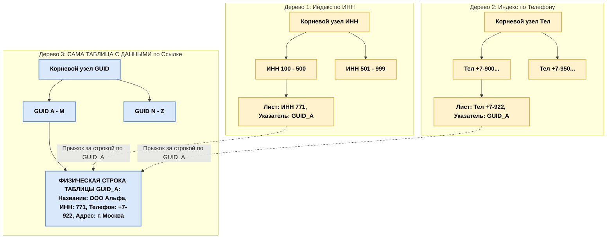
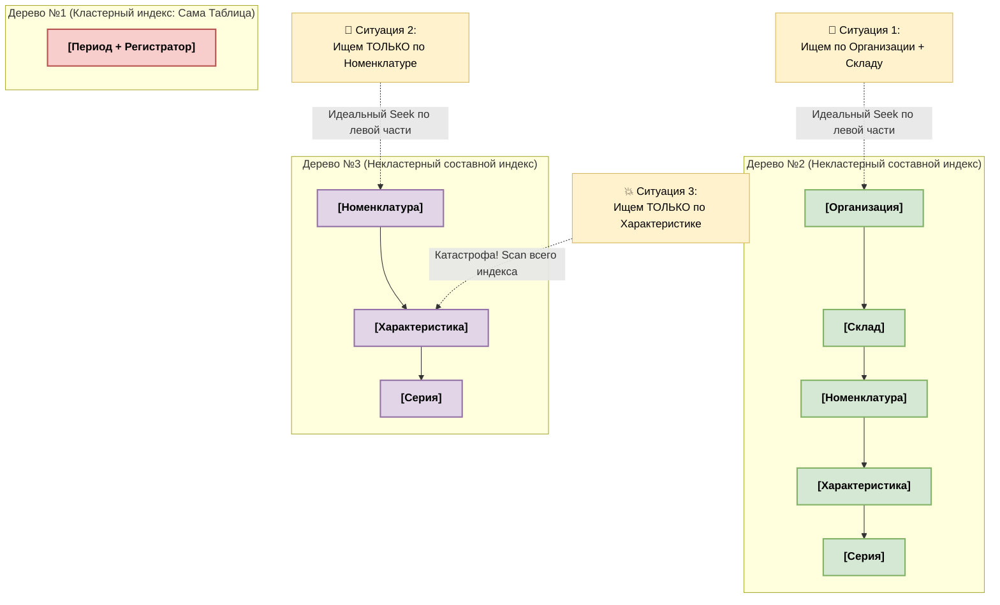
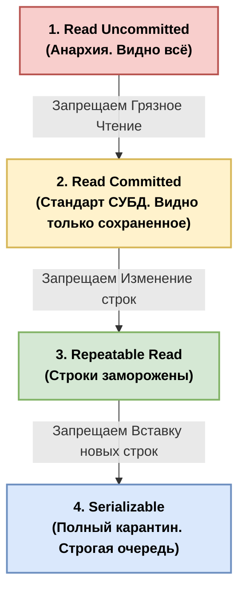
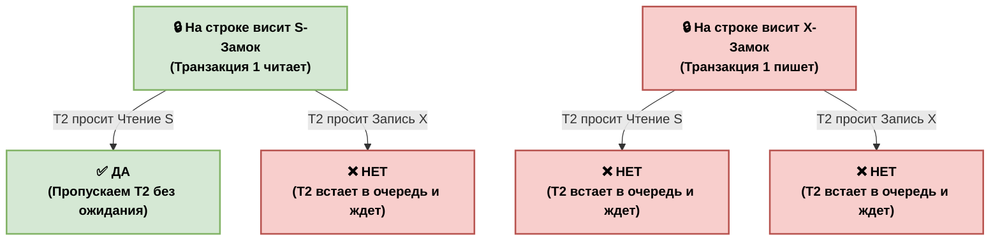
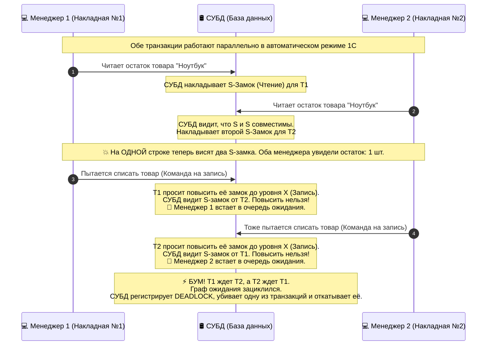
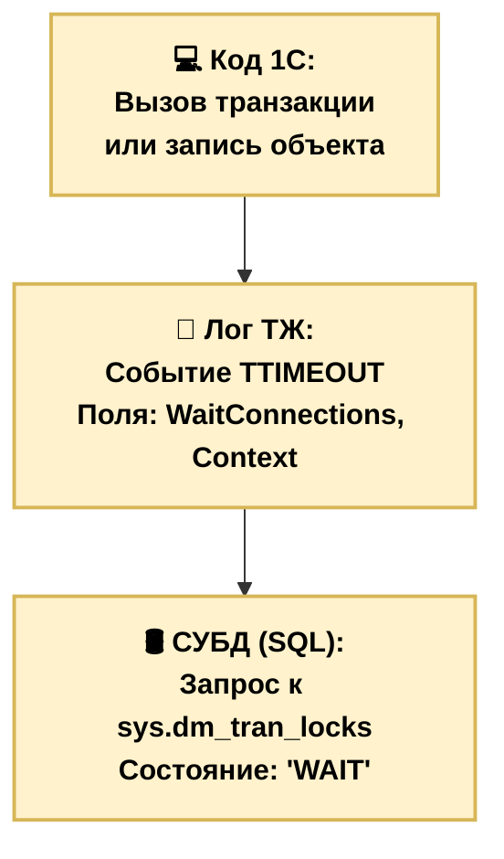
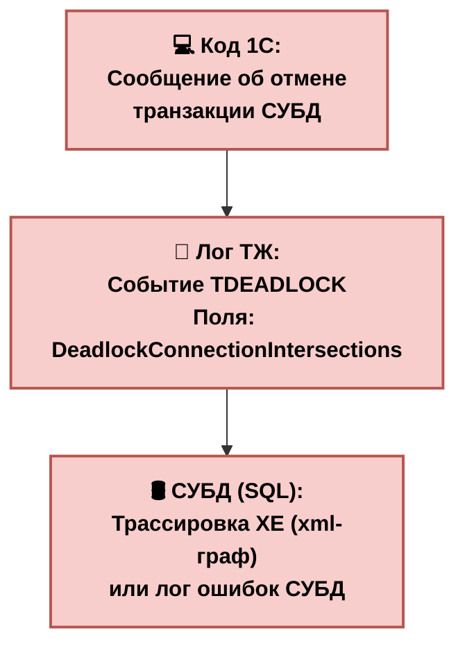
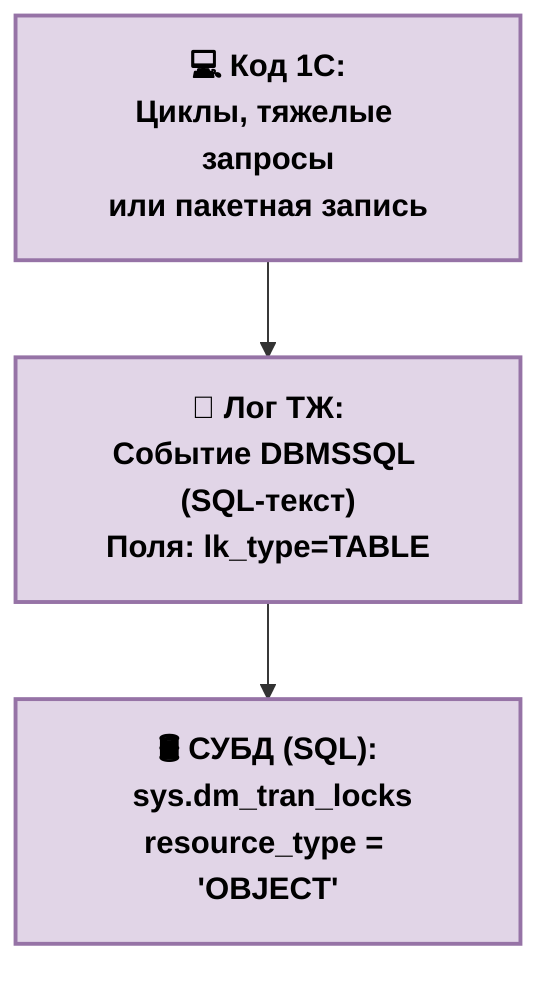

# 🏛 Архитектура СУБД глазами 1С-разработчика

Этот путеводитель создан для того, чтобы раз и навсегда визуализировать, как абстрактные объекты 1С превращаются в жесткие физические структуры на диске под управлением СУБД.

---

## 🛑 Уровень 1. Главное заблуждение (Как делать НЕ надо)

Когда мы думаем о нескольких индексах, подсознание часто рисует **вложенные матрешки**: одно дерево внутри другого. 

> **ВНИМАНИЕ:** СУБД так **НЕ** делает! Если бы внутри каждого «листика» одного дерева росло новое дерево, база данных моментально забила бы всю память компьютера и превратилась в кашу.

```text
❌ НЕПРАВИЛЬНАЯ СХЕМА (Вложенная абстракция):
[БД] 
 └── [Таблица объекта] 
          └── [Дерево ИНН] 
                   └── [Лист: ИНН 7701] 
                            └── [Вложенное дерево Телефон] (Так СУБД НЕ делает!)
```

---

## 🟢 Уровень 2. Реальная анатомия СУБД (Независимые дороги)

На самом деле, каждый индекс — это **абсолютно автономная структура (B-Tree)**. Они лежат на диске рядышком, параллельно друг другу. Они ничего не знают о существовании соседа.

Представим таблицу `Справочник.Контрагенты`. У нее есть **1 Кластерный индекс** (сама таблица) и **2 Некластерных индекса** (по ИНН и по Телефону).

### Физическая карта данных на диске:



### 🧠 Как Оптимизатор СУБД выбирает маршрут?
Когда ты пишешь запрос `ГДЕ ИНН = "771"`, программа-навигатор (Оптимизатор) смотрит на эту карту и говорит: 
1. *«Ага, нам нужен ИНН. В Дерево 2 (Телефон) идти смысла нет. Идем в Дерево 1.»*
2. СУБД спускается по **Дереву 1**, находит ИНН `771`.
3. Видит указатель `GUID_A`.
4. Совершает прыжок в **Дерево 3 (Кластерный индекс)** и забирает готовую строку со всеми остальными полями (ООО "Альфа"). Это действие называется **Index Seek**.

---

## ⚡ Уровень 3. Хардкор — Регистр Накопления с 5 измерениями

Теперь перенесемся в `РегистрНакопления.Товары`. У нас 5 измерений: `Организация`, `Склад`, `Номенклатура`, `Характеристика`, `Серия`.

Поскольку регистр — объект **нессылочный**, у него нет одного поля `Ссылка` (`GUID`) для каждой записи. Платформа 1С заставляет СУБД создать структуру из **трех параллельных деревьев**, чтобы поиск по разным аналитикам не тормозил.

### Физическая структура регистра на диске:


| Структура в СУБД | Тип индекса | Порядок полей в дереве (Сцепка) | Главная задача структуры |
| :--- | :--- | :--- | :--- |
| **Дерево №1** | **Кластерный** | `Период + Регистратор + НомерСтроки` | Это **сама таблица с данными**. Нужна, чтобы 1С могла мгновенно удалить или перезаписать движения, когда документ перепроводится. |
| **Дерево №2** | **Некластерный** | `Организация + Склад + Номенклатура + Характеристика + Серия` | Нужен для быстрых остатков по конкретной **Организации** или цепочке **Организация + Склад**. |
| **Дерево №3** | **Некластерный** | `Номенклатура + Характеристика + Серия + ...` | Авто-оптимизация от 1С. Нужен, чтобы запросы, где ищут чистую **Номенклатуру** (без указания организации), не вешали базу. |


---

## ⚡ Уровень 3.1. Визуальный хардкор — Поиск по 5 измерениям

Давай наглядно посмотрим, как Оптимизатор СУБД выбирает, в какое из трех доступных деревьев регистра `Товары` отправить наш поисковый робот.

### Карта дорог Оптимизатора для Регистра Накопления:



### 🚥 Как отрабатывают эти ситуации в жизни:

1. **Ситуация 1 (`ГДЕ Организация = А И Склад = Б`)**: Оптимизатор видит, что запрос идеально совпадает с началом **Дерева №2**. Поисковик заходит в корень `[Организация]`, мгновенно отсекает другие компании, переходит на нужный `[Склад]` и забирает данные. Это чистый **Index Seek**.
2. **Ситуация 2 (`ГДЕ Номенклатура = Стул`)**: Если бы у нас было только Дерево №2, СУБД ушла бы в полный скан (ведь `Номенклатура` там спрятана в глубине). Но Оптимизатор видит **Дерево №3**, где `Номенклатура` стоит на первом месте! Он выбирает этот маршрут и делает быстрый **Index Seek**.
3. **Ситуация 3 (`ГДЕ Характеристика = Красный`)**: Ни в одном дереве `Характеристика` не стоит на первом («левом») месте. Оптимизатор вздыхает, выбирает **Дерево №3** (оно физически меньше по объему, чем Дерево №2), заходит в него и запускает **Index Scan** — читает абсолютно все характеристики всех товаров подряд. База начинает виснуть.

---

## 📉 Уровень 4. Разница между Seek и Scan наглядно

Представим **Дерево №2** (`Организация + Склад + Номенклатура...`). Данные внутри него отсортированы строго как слова в словаре: сначала по первому слову, внутри него по второму.

### 🟢 Сценарий 1: Идеальный навигатор (Index Seek)
```bsl
// Запрос в 1С:
Выбрать * Из РегистрНакопления.Товары Где Организация = &Орг И Склад = &Склад
```
* **Поведение СУБД:** Заходит в **Дерево №2**. Так как поиск начинается с `Организации` (самое первое поле индекса), СУБД сразу отсекает 99% ненужных веток, прыгает точно в цель и выдает результат. 
* **Итог:** **Index Seek** (Быстрый точечный поиск).

### 🔴 Сценарий 2: Дорожная катастрофа (Index Scan)
```bsl
// Запрос в 1С (Забыли указать Организацию!):
Выбрать * Из РегистрНакопления.Товары Где Склад = &Склад
```
* **Поведение СУБД:** Заходит в **Дерево №2**. Пытается найти `Склад`. Но дерево отсортировано по *Организациям*! Склад "Основной" может быть «размазан» внутри Организации "Альфа", Организации "Бета" и т.д.
* СУБД не может прыгнуть в конкретную ветку. Ей приходится включать **Index Scan** — уныло читать **ВСЁ дерево от начала до конца**, перебирая миллионы строк. База ложится колом.

---

## 💡 Главный чек-лист 1С-Архитектора:
1. **Порядок имеет значение:** В составных индексах (регистрах) порядок измерений в дереве конфигурации определяет порядок полей в индексе СУБД.
2. **Правило левой руки:** Чтобы индекс работал эффективно (`Seek`), в условии запроса обязательно должно быть самое **первое (левое)** поле этого индекса.
3. **Галочка «Индексировать»:** Если пользователи часто ищут по какому-то измерению отдельно (например, по `Серии`), поставь ему эту галочку в конфигураторе. 1С создаст для СУБД **еще одно независимое дерево**, где `Серия` встанет на первое место!


# 🔒 Часть 2. Уровни изоляции транзакций и Аномалии данных

Когда на сервер СУБД одновременно набегают десятки пользователей 1С, их транзакции начинают выполняться параллельно. Если никак их не изолировать друг от друга, в базе начнется хаос и искажение данных.

---

## 🛑 Уровень 1. Три главные катастрофы (Аномалии параллелизма)

Уровни изоляции были придуманы для того, чтобы бороться с тремя классическими проблемами совместной работы.

### 1. 🎭 Грязное чтение (Dirty Read)
Транзакция №1 изменила строку (например, остаток товара = 0), но еще не нажала кнопку «Зафиксировать» (Commit). В этот момент Транзакция №2 прочитала этот остаток. После этого Транзакция №1 отменилась (Rollback). 
* **Итог:** Транзакция №2 поработала с «призрачными» данными, которых физически в базе уже нет.

### 2. 🌀 Неповторяющееся чтение (Non-Repeatable Read)
Транзакция №1 внутри себя дважды читает одну и ту же строку. В перерыве между этими чтениями Транзакция №2 зашла, изменила эту строку и зафиксировала изменения.
* **Итог:** Внутри одной транзакции один и тот же запрос выдал разные данные для одной строки. Код 1С ломается от удивления.

### 3. 👻 Фантомное чтение (Phantom Read)
Транзакция №1 делает запрос по диапазону (например, «Дай все документы за сегодня, их 5 штук»). В этот момент Транзакция №2 создает и сохраняет НОВЫЙ шестой документ. Транзакция №1 снова делает тот же запрос и видит уже 6 документов.
* **Итог:** Из ниоткуда материализовалась новая строка-фантом.

---

## 🟢 Уровень 2. Четыре классических уровня изоляции (ANSI SQL)

СУБД предлагает на выбор 4 режима жесткости карантина для транзакций. Чем выше уровень, тем чище данные, но тем ниже скорость работы базы из-за жестких блокировок.

### Карта уровней изоляции и защищенности:



---

## ⚡ Уровень 3. Стыковка с 1С: Автоматический и Управляемый режимы

Вот тут и скрывается главный секрет производительности 1С-архитектора. Режим управления блокировками в свойствах твоей конфигурации кардинально меняет уровень изоляции на стороне СУБД!


| Режим блокировок в 1С | Какой уровень ставится в СУБД | Как СУБД ведет себя на физическом уровне | Главная беда режима |
| :--- | :--- | :--- | :--- |
| **Автоматический** | `Repeatable Read` или `Serializable` | СУБД вешает **жесткие блокировки** на чтение. Если ты просто читаешь остатки товара запросом, никто в этот момент не может этот товар продать. Все стоят в очереди. | **Дедлоки (Взаимоблокировки)**. База виснет при работе более 5-10 человек. |
| **Управляемый** | `Read Committed` (Snapshot) | СУБД работает в легком режиме. При чтении СУБД **вообще не ставит блокировок**. Чтение не блокирует запись, запись не блокирует чтение. | СУБД больше **не гарантирует** защиту от аномалий (целостность данных). |

### 💥 Стоп! Если в управляемом режиме СУБД расслабляется, как 1С защищает данные от искажения?

Поскольку на уровне `Read Committed` СУБД разрешает параллельным транзакциям читать одни и те же данные, две разные накладные в 1С могут одновременно прочитать остаток товара (например, 1 штука), обе решат, что товара хватает, и спишут его в минус.

Чтобы этого не произошло, **1С забирает контроль у СУБД**. 
В управляемом режиме СУБД просто быстро пишет и читает данные. А за тем, чтобы пользователи не хватали одну и ту же строку, следит специальная программа внутри сервера приложений — **Менеджер управляемых блокировок 1С**. 

Программист 1С сам руками в коде пишет: `Блокировка.Заблокировать()`, выставляя виртуальный замок в памяти 1С, не нагружая тяжелыми блокировками саму СУБД.


---

# 🔓 Часть 3. Виды блокировок СУБД (Замки на данных)

Когда транзакция выполняется в рамках своего уровня изоляции, СУБД начинает вешать на данные физические «замки». Существует два самых главных, базовых типа блокировок.

## 🟢 1. Разделяемая блокировка (Shared Lock / S-Блокировка)
Это блокировка **для чтения данных**. 
* **Логика:** Когда транзакция читает строку (например, проверяет остаток товара), она вешает на нее S-блокировку. Этим она говорит СУБД: *«Я сейчас читаю эту строку. Пусть другие её тоже читают, мне не жалко. Но изменять её нельзя, пока я не закончу транзакцию!»*.
* **Совместимость:** Несколько транзакций могут одновременно повесить S-блокировку на одну и ту же строку. **Чтение никогда не мешает чтению**.

## 🔴 2. Исключительная блокировка (Exclusive Lock / X-Блокировка)
Это блокировка **для изменения данных** (запись, обновление, удаление).
* **Логика:** Когда транзакция хочет изменить строку (например, списать товар), она вешает на нее X-блокировку. Этим она заявляет: *«Я Хозяин этой строки. Всем отойти! Никому нельзя её ни читать, ни изменять, пока я не завершу свою транзакцию!»*.
* **Совместимость:** X-блокировка эгоистична. Она несовместима вообще ни с чем. Если на строке уже висит X-блокировка, никто другой не сможет к ней подступиться.

---

## ⚔️ Уровень 3.1. Матрица совместимости замков

Оптимизатор СУБД принимает решения на основе очень простых правил. Если Транзакция №1 уже держит блокировку на строке, а Транзакция №2 пытается прийти со своим запросом, СУБД сверяется со следующей логической картой:



---

## 💀 Уровень 3.2. Анатомия Дедлока при конвертации (Conversion Deadlock)

Помнишь, мы говорили, что в **Автоматическом режиме** 1С заставляет СУБД работать на жестком уровне `Repeatable Read`? Ниже пошаговая физическая схема того, как обычное чтение остатков двумя пользователями одновременно гарантированно взрывает базу данных дедлоком.



### 🧠 Главный вывод Архитектора:
Дедлок при конвертации (`S -> X`) — это главная родовая травма автоматического режима блокировок в 1С. Избежать её в коде практически невозможно, если база нагружена. Единственное системное решение проблемы — полный переход на **Управляемый режим блокировок**, который переводит СУБД на рельсы версионирования строк.


# 🕵️‍♂️ Часть 4. Детектив СУБД: Как ловить дедлоки, эскалации и ожидания

Когда база начинает виснуть или сыпать ошибками, архитектор 1С не гадает на кофейной гуще. Он смотрит на три источника правды: **Код 1С**, **Лог Технологического Журнала (ТЖ)** и **Системные динамические представления СУБД (DMV)**.

---

## 🚦 Сценарий 1. Превышение времени ожидания (Lock Timeout)
Это та самая ситуация из Черной Пятницы, когда миллион человек встали в очередь к одной строке (или к одной таблице после эскалации).

### 🔍 Карта симптомов во всех системах:



### 1. Как это выглядит в 1С (Ошибка пользователя):
```text
Конфликт блокировок при выполнении транзакции:
Превышено максимальное время ожидания предоставления блокировки!
```

### 2. Как это поймать в Технологическом Журнале (ТЖ):
Для этого в `logcfg.xml` должен быть настроен сбор события `TTIMEOUT`. В логе ты увидишь строку:
```text
42:15.123-0,TTIMEOUT,4,process=rphost,p:processName=Trade,t:connectID=125,SessionID=45,
WaitConnections=89, Context='Документ.РеализацияТоваровУслуг.МодульОбъекта : 45 : Движения.Товары.Записать();'
```
* **Как читать:** Сессия №45 (`SessionID=45`) пыталась записать движения. Она ждала целых 20 секунд и отвалилась. Виновник, который держал замок и не пускал её — сессия №89 (`WaitConnections=89`). Иди искать в логе, что в эти 20 секунд делала сессия 89.

### 3. Как это увидеть в СУБД прямо сейчас (Живой мониторинг):
Выполни этот SQL-запрос в SQL Server Management Studio (SSMS), чтобы увидеть, кто кого блокирует прямо в данную секунду:
```sql
SELECT 
    request_session_id AS WaitingSessionID,
    blocking_session_id AS BlockingSessionID,
    resource_type AS LockedResource,
    request_mode AS LockType,
    request_status AS Status
FROM sys.dm_os_waiting_tasks w
JOIN sys.dm_tran_locks l ON w.resource_address = l.lock_owner_address
WHERE blocking_session_id IS NOT NULL;
```

---

## 💥 Сценарий 2. Взаимоблокировка (Deadlock)
Тот самый замкнутый круг (А->Б, Б->А) или дедлок на некластерном индексе. СУБД сама убивает одну из транзакций.

### 🔍 Карта симптомов во всех системах:



### 1. Как это выглядит в 1С (Ошибка пользователя):
```text
Взаимоблокировка транзакций. 
Транзакция была отменена на стороне СУБД!
```

### 2. Как это поймать в Технологическом Журнале (ТЖ):
Настраиваем сбор события `TDEADLOCK`. Получаем в логе такую картину:
```text
45:10.567-0,TDEADLOCK,4,process=rphost,p:processName=Trade,t:connectID=125,SessionID=45,
DeadlockConnectionIntersections=89 45, Context='РегистрНакопления.Товары : Запись'
```
* **Как читать:** Платформа четко говорит: Произошел дедлок. Пересеклись сессии `89` и `45`. Одну из них СУБД выбрала в качестве "жертвы" (Deadlock Victim) и принудительно убила, чтобы разорвать порочный круг.

### 3. Как вытащить граф дедлока из СУБД (Для экспертов):
СУБД умеет отдавать дедлок в виде красивой XML-схемы, где нарисованы стрелочки — кто кого ждал. В MS SQL Server включи системное событие `xml_deadlock_report` в Extended Events или выполни запрос к системному логу:
```sql
-- Чтение последних дедлоков из системного буфера MS SQL
SELECT 
    XEventData.XEvent.value('(data/value)[1]', 'varchar(max)') AS DeadlockGraph
FROM 
    (SELECT CAST(target_data AS XML) AS TargetData 
     FROM sys.dm_xe_session_targets st
     JOIN sys.dm_xe_sessions s ON s.address = st.event_session_address
     WHERE s.name = 'system_health' AND st.target_name = 'ring_buffer') AS Data
CROSS APPLY TargetData.nodes('RingBufferTarget/event[@name="xml_deadlock_report"]') AS XEventData(XEvent);
```

---

## 📈 Сценарий 3. Эскалация блокировок (Lock Escalation)
Когда одна транзакция заблокировала больше 5000 строк и СУБД бахнула замок на всю таблицу, парализовав параллельную работу.

### 🔍 Карта симптомов во всех системах:



### 1. Как это выглядит в 1С:
Ошибки на экране нет! Но все пользователи внезапно начинают виснуть на ровном месте, даже если они работают с совершенно другими элементами справочников или документов.

### 2. Как это поймать в Технологическом Журнале (ТЖ):
В событии `DBMSSQL` (запросы к СУБД) или `TLOCK` (если режим автоматический) нужно искать укрупнение типа блокировки.
```text
// Обрати внимание на параметр lk_type. Если там TABLE (или OBJECT) вместо RID/KEY — это эскалация
50:20.111-5000,DBMSSQL,4,process=rphost,SessionID=45,lk_type=TABLE,
Context='Выборка = Запросы.Номенклатура.Выбрать(); Пока Выборка.Следующий() Цикл...'
```

### 3. Как найти таблицу-жертву внутри СУБД:
Запусти этот запрос во время зависания базы. Он покажет, на каких таблицах сейчас висят блокировки целого уровня (OBJECT), а не отдельных строк:
```sql
SELECT 
    request_session_id AS SessionID,
    DB_NAME(resource_database_id) AS BaseName,
    OBJECT_NAME(resource_associated_entity_id) AS TableName,
    request_mode AS LockMode,
    resource_type AS LockGranularity
FROM sys.dm_tran_locks
WHERE resource_type = 'OBJECT' -- OBJECT означает блокировку ВСЕЙ таблицы
  AND request_session_id > 50; -- Игнорируем системные процессы SQL
```

---

## 💡 Чек-лист спасения для Архитектора:
1. **Тайм-аут (`TTIMEOUT`)**: Виноват всегда долгий «сосед». Ищи сессию из поля `WaitConnections` и смотри, какой bsl-код она выполняла.
2. **Дедлок (`TDEADLOCK`)**: Виноваты оба участника. Смотри контекст обеих сессий. Проверяй порядок обхода таблиц в коде или избавляйся от лишних некластерных индексов.
3. **Эскалация (`TABLE`)**: Виноват слишком большой объем данных в одной транзакции. Режь порции! Не записывай по 50 000 строк за раз. Делай `ЗафиксироватьТранзакцию()` каждые 1000 строк.
