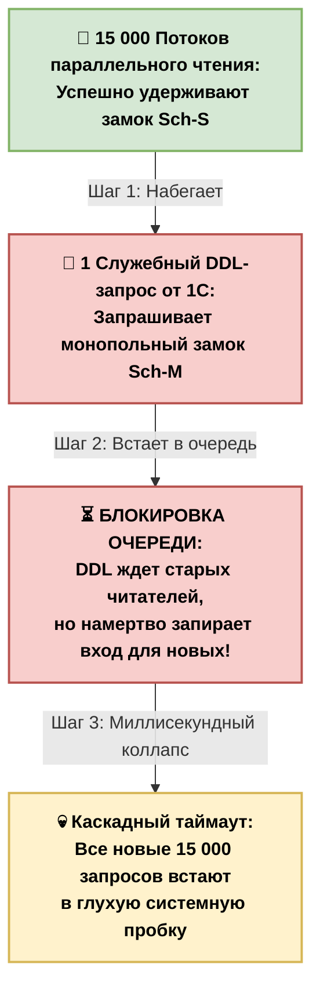

# 🛠️ Тонкость 1. Блокировки и контенция метаданных (Metadata & Schema Locks) при RPS 15 000+

На экстремальных нагрузках (RPS 15 000+) база данных чаще всего ложится не из-за классических дедлоков по строкам таблиц, а из-за **системного паралича самого ядра СУБД**, вызванного конфликтом блокировок метаданных. 

Ниже представлена детальная физика, триггеры и архитектурная матрица решений для устранения этой проблемы.

---

## 🪓 Уровень 1. Физика процессов в ядре СУБД: Sch-S против Sch-M

Каждый раз, когда СУБД выполняет любой, даже самый микроскопический запрос `SELECT`, `INSERT` или `UPDATE`, она обязана гарантировать, что структура таблицы не изменится прямо во время чтения или записи.

Для этого ядро СУБД накладывает на всю таблицу системную блокировку **`Sch-S` (Schema Stability — Стабильность схемы)**.
* Блокировки `Sch-S` абсолютно бесплатны для процессора.
* Они полностью совместимы друг с другом. 15 000 потоков могут одновременно держать `Sch-S` на одной таблице. **Чтение метаданных не мешает чтению**.

Катастрофа начинается, когда в базу прилетает хотя бы одна DDL-команда (изменение структуры, индексов или итогов). Для изменения структуры СУБД обязана наложить блокировку **`Sch-M` (Schema Modification — Изменение схемы)**.
* Замок `Sch-M` **категорически несовместим** ни с какими другими блокировками, включая легкие `Sch-S`.

### Схема каскадного коллапса очереди:



### 🚨 Капкан очереди (FIFO в ядре СУБД)
Когда DDL-запрос требует `Sch-M`, он не может его получить, пока хотя бы один из старых 15 000 потоков удерживает `Sch-S`. DDL-запрос послушно встает в системную очередь ожидания. 

Но по законам СУБД, **как только в очередь встал запрос на `Sch-M`, он моментально блокирует вход для всех последующих запросов!** Все новые 15 000 потоков, которые прилетели в следующую секунду, не могут получить даже легкий `Sch-S`. Они выстраиваются в каскадную очередь за замком `Sch-M`. Система умирает за доли секунды, отправляя базу в тайм-аут.

---

## 💣 Уровень 2. Главные триггеры блокировок метаданных в 1С

В обычных приложениях метаданные меняются только при обновлении релиза. Но платформа 1С устроена иначе. Она дергает метаданные и системные каталоги СУБД прямо во время штатной работы пользователей.

### 🔥 Триггер №1. Управление итогами регистров накопления
Это самый главный убийца баз данных в 1С. Когда платформа выполняет автоматическое смещение и фиксацию итогов регистра (например, при переходе границы месяца или при записи наборов за прошлые периоды), она может выполнять операции `ALTER TABLE` или манипулировать системными индексами таблиц итогов (`_AccumRgT`). В этот момент в СУБД летит команда, требующая `Sch-M`. При RPS 15 000+ это мгновенный таймаут всей базы.

### 🔥 Триггер №2. Автоматическое обновление статистики (Auto-Update Statistics)
По умолчанию в СУБД включена опция автоматического сбора статистики. Когда количество измененных строк в таблице достигает определенного порога, СУБД прямо посреди рабочего дня решает: *«Пора обновить статистику!»*. 
Чтобы обновить статистику, СУБД генерирует внутренний план, который в момент фиксации данных блокирует системные таблицы метаданных (`sys.sysschobjs`, `sys.sysidxstats`). При высокой нагрузке эта фоновая операция блокирует системный каталог, вызывая мгновенный лавинообразный простой.

### 🔥 Триггер №3. Постоянная перекомпиляция (`OPTION (RECOMPILE)`)
Если в высоконагруженном bsl-коде (который вызывается тысячи раз в секунду) программист засунул хинт `OPTION (RECOMPILE)` или платформа сама решает перекомпилировать план из-за изменения данных, СУБД начинает непрерывно штурмовать кэш планов и системный каталог метаданных, чтобы прочитать схему таблицы для построения нового плана. Процессор улетает в 100% не на выполнение запроса, а на чтение метаданных самой СУБД.

---

## 🛠️ Уровень 3. Как это выявлять в СУБД (Инструментарий эксперта)

Если база внезапно встала, а процессоры загружены, открывай SSMS и выполняй системный скрипт для поиска блокировок метаданных:

```sql
-- Ищем сессии, которые удерживают или ждут блокировки схемы (Sch-S / Sch-M)
SELECT 
    request_session_id AS [ID Сессии],
    resource_type AS [Тип ресурса],
    resource_description AS [Описание ресурса],
    request_mode AS [Тип замка (Sch-S / Sch-M)],
    request_status AS [Статус запроса (GRANT / WAIT)]
FROM 
    sys.dm_tran_locks
WHERE 
    resource_type = 'METADATA' 
    OR request_mode LIKE '%Sch%';
```
Если в результатах есть сессия со статусом `WAIT` и типом замка `Sch-M` — ты нашел эпицентр аварии. Поле `request_session_id` покажет, какой именно rphost или фоновое задание 1С пытается перестроить систему.

---

## 🔀 Уровень 4. Архитектурные варианты решения (Смотрим по ситуации)

Универсальной кнопки «Сделать быстро» здесь нет. Архитектор выбирает стратегию в зависимости от бизнес-процессов компании.

### 📊 Матрица решений для борьбы с Metadata Locks:


| Вариант решения | Как реализуется технически | Плюсы решения | Минусы решения | Когда применять |
| :--- | :--- | :--- | :--- | :--- |
| **Вариант А:<br>Асинхронная статистика** | В свойствах базы SQL включается опция:<br>`ALTER DATABASE [Имя_Базы] SET AUTO_UPDATE_STATISTICS_ASYNC ON` | СУБД больше не блокирует запросы пользователей для обновления статистики. Она считает её в фоновом потоке. | Оптимизатор СУБД может несколько минут работать по старой статистике и построить неоптимальный план. | **Обязательно для всех баз 1С с RPS от 5 000+.** Лечит триггер №2. |
| **Вариант Б:<br>Технологические окна** | Запрет на ручное или программное управление итогами (`УстановитьПериодРассчитанныхИтогов()`) в рабочее время. Все регламенты переносятся на ночь. | Полная безопасность. В рабочее время в базу летят только чистые DML-команды (`INSERT/UPDATE`), метаданные не шевелятся. | Если за день набьется слишком много движений, ночные регламенты могут не успеть отработать до утра. | **Применяется всегда в ERP и УТ системах крупных холдингов.** |
| **Вариант В:<br>Физическое разделение контуров** | Настройка репликации СУБД (MS SQL *AlwaysOn*). Читающие пользователи и BI-системы подключаются к Read-Only реплике. | 15 000 запросов на чтение улетают на другой сервер. Блокировки `Sch-S` на реплике физически не могут пересечься с DDL-командами на Master-базе. | Высокая стоимость железа. Асинхронное отставание данных на реплике (доли секунды). | **Единственный выбор при нагрузках RPS 20 000+** и круглосуточном цикле работы (24/7). |

---

## 💡 Резюме для памятки по Тонкости №1:
На сверхвысоком RPS метаданные неприкосновенны. Любая попытка изменить структуру, пересчитать итоги или обновить статистику в синхронном режиме превращает базу в кирпич из-за блокировки схемы (`Sch-M`). Главное оружие архитектора — **включение асинхронной статистики** и **полная изоляция читающего RPS на реплики СУБД**.


# 🛠️ Тонкость 2. Тонкости высоконагруженных систем: Неявное преобразование типов в PostgreSQL (1C + Psycopg2)

При нагрузках уровня **RPS 15 000 – 50 000+** в связке Python-шлюза и PostgreSQL любая ошибка в типизации входящих параметров приводит к моментальной деградации СУБД.

---

## 1. Физика процесса в PostgreSQL: Почему падает сервер?

В СУБД PostgreSQL все уникальные идентификаторы (ссылки) таблиц 1С хранятся в бинарном типе данных **`bytea`** (в поле `_IDRRef`). 

### Проблема типов: text vs bytea
Если Python-скрипт передает GUID как обычную строку (`str`), драйвер `psycopg2` отправляет запрос с параметром типа `text`/`unknown`. 

1. **Отсутствие прямого неявного приведения**: В чистом PostgreSQL нет автоматического неявного каста (implicit cast) из `text` в `bytea`. 
2. **Точка отказа**: При попытке сравнить `WHERE _IDRRef = '4a2b3c4d...'` планировщик PostgreSQL либо вернет ошибку `operator does not exist: bytea = text`, либо (при наличии кастомных правил приведения) будет вынужден применить функцию преобразования к **каждой строке таблицы на диске**.
3. **Seq Scan**: Вместо быстрого поиска по индексу (`Index Scan`) СУБД переходит к полному последовательному чтению всей таблицы (**Seq Scan**). На миллиардных таблицах при высоком RPS это мгновенно утилизирует CPU и забивает дисковую очередь, превращая сервер в «кирпич» за доли секунды.

### Сравнение стратегий поиска СУБД


| Критерий | СИТУАЦИЯ А: Типы совпадают (`bytea = bytea`) | СИТУАЦИЯ Б: Ошибка типов (`bytea = text`) |
| :--- | :--- | :--- |
| **Режим поиска** | **Index Scan (Норма)** | **Seq Scan (Катастрофа)** |
| **Алгоритм** | Поиск по B-Tree дереву индекса | Полное последовательное сканирование диска |
| **Сложность** | Логарифмическая: \(O(\log N)\) (3–4 операции для поиска) | Линейная: \(O(N)\) (чтение миллиарда строк подряд) |
| **Влияние на прод** | Минимальная нагрузка, быстрый ответ | 100% CPU утилизация, блокировка пула потоков |


### График деградации производительности при переходе к линейному сканированию


---

## 2. Специфика 1С: Схема разворота байт GUID

Платформа 1С хранит GUID в СУБД в перевернутом виде (смесь Little-Endian и Big-Endian). Если просто перевести строку UUID во внешний массив байт, PostgreSQL выполнит Index Scan, но вернет пустой результат, так как данные не совпадут.

Порядок пересборки блоков для записи в поле `_IDRRef`:
* **Исходный GUID**: Разбивается на 5 стандартных блоков: `[Блок 1]-[Блок 2]-[Блок 3]-[Блок 4]-[Блок 5]`.
* **Формат 1С**: Блоки меняются местами, а внутри первых трех блоков байты разворачиваются задом наперед. Финальный массив собирается в последовательности: `[Блок 5] + [Блок 4] + [Развернутый Блок 3] + [Развернутый Блок 2] + [Развернутый Блок 1]`.

---

## 3. Решение на Python: Flask + Psycopg2

Чтобы `psycopg2` корректно передал параметр в PostgreSQL как `bytea`, значение должно быть передано как чистый тип `bytes`.

### Реализация функции конвертации и безопасного запроса

```python
import binascii
import psycopg2

def uuid_to_1c_bytea(uuid_str: str) -> bytes:
    """
    Конвертирует стандартный UUID в 16-байтовую строку (bytes),
    полностью совместимую с физическим хранением _IDRRef в PostgreSQL для 1С.
    """
    hex_str = uuid_str.replace('-', '')
    if len(hex_str) != 32:
        raise ValueError("Некорректный формат UUID")
        
    # Разрезаем UUID на 5 оригинальных блоков
    p1 = hex_str[0:8]    # 4 байта
    p2 = hex_str[8:12]   # 2 байта
    p3 = hex_str[12:16]  # 2 байта
    p4 = hex_str[16:20]  # 2 байта
    p5 = hex_str[20:32]  # 6 байт

    # Разворачиваем байты внутри первых трех блоков (Little-Endian)
    p1_rev = p1[6:8] + p1[4:6] + p1[2:4] + p1[0:2]
    p2_rev = p2[2:4] + p2[0:2]
    p3_rev = p3[2:4] + p3[0:2]
    
    # Собираем в порядке 1С: p5 + p4 + p3_rev + p2_rev + p1_rev
    bytes_1c_str = p5 + p4 + p3_rev + p2_rev + p1_rev
    return binascii.unhexlify(bytes_1c_str)


# --- Высоконагруженное выполнение пакета через executemany ---

# Строгая типизация параметров (передаем список кортежей с типом bytes)
data_to_update = [
    (uuid_to_1c_bytea("4a2b3c4d-a1b2-c3d4-e5f6-7a8b9c0d1e2f"), "Товар 1"),
    (uuid_to_1c_bytea("5e6f7a8b-b2c3-d4e5-f6a7-8b9c0d1e2f3a"), "Товар 2"),
]

conn = psycopg2.connect("dbname=one_c_prod user=postgres")
cursor = conn.cursor()

# Используем подготовленное выражение. 
# Драйвер маппит Python bytes -> PostgreSQL bytea.
# СУБД гарантированно делает мгновенный INDEX SCAN для каждой строки.
cursor.executemany(
    "UPDATE _Reference100 SET _Description = %s WHERE _IDRRef = %s",
    [(name, guid) for guid, name in data_to_update]
)

conn.commit()
cursor.close()
conn.close()
```

---

## 4. Архитектурный чек-лист для RPS 50 000+ в PostgreSQL

1. **Мониторинг `pg_stat_statements`**: Регулярно проверять топ запросов по общему времени выполнения (`total_plan_time` + `total_exec_time`). Если у простых селектов по GUID высокий `shared_blks_read` — там гарантированно идет скрытый Seq Scan.
2. **Использование `psycopg2.Binary`**: Если в старых версиях Python/драйвера сырые `bytes` интерпретируются некорректно, оборачивайте их принудительно: `psycopg2.Binary(guid_bytes)`.
3. **Логирование долгих запросов**: В `postgresql.conf` выставить `log_min_duration_statement = 200` (в мс) и отслеживать планы через `auto_explain`, чтобы моментально ловить неоптимальные сканирования до того, как они положат прод.


# 🛠️ Тонкость 3. Тонкости высоконагруженных систем: Смерть в tempdb — невидимые таблицы Spills (Сбросы на диск)

При RPS 15 000+ операции, которые должны выполняться мгновенно в оперативной памяти (ОЗУ), могут внезапно переключиться на дисковую подсистему через базу данных `tempdb`. Это явление называется **Sort/Hash Spill**.

---

## 1. Физика процесса: Механизм Hash & Sort Spill

Когда СУБД выполняет соединения больших таблиц (`Hash Match`) или сортировку данных (`Merge Sort`), оптимизатор выделяет запросу строго фиксированный квант оперативной памяти — **Memory Grant**.

### Как захлопывается капкан

1. **Устаревшая статистика**: Оптимизатор строит план на основе старых индексов и статистик. Он «думает», что в выборке будет 1000 строк, и выделяет запросу скромный Memory Grant (например, 5 МБ).
2. **Параметрический сбой (Parameter Sniffing)**: В запрос прилетает параметр, который вместо 1000 строк поднимает из базы миллион записей.
3. **Исчерпание лимита**: Выделенные 5 МБ заканчиваются прямо посреди выполнения операции. СУБД **не может** динамически допросить у ОС еще памяти для этого конкретного шага.
4. **Включение Spill**: СУБД активирует механизм сброса. Недосчитанная хэш-таблица или массив для сортировки начинают постранично записываться во временные таблицы базы `tempdb` на жесткий диск (SSD/NVMe).
5. **Дисковый шторм**: Скорость работы с диском (даже быстрым NVMe) на порядки ниже скорости ОЗУ. Нагрузка RPS 15 000+ превращает этот сброс в лавину: новые запросы встают в очередь, утилизируют дисковую стойку (ожидания `PAGEIOLATCH_SH`, `WRITELOG`), и сервер полностью перестает отвечать.

---

## 2. Сравнение работы в ОЗУ и сброса на диск (Spill)


| Метрика эффективности | Операция в ОЗУ (Идеал) | Сброс в tempdb (Катастрофа) |
| :--- | :--- | :--- |
| **Ресурс выполнения** | Оперативная память (Memory Grant) | Дисковая подсистема (`tempdb` файлы) |
| **Ожидания СУБД (Wait Stats)** | `CXPACKET` / `SOS_SCHEDULER_YIELD` | `PAGEIOLATCH_SH` / `PAGEIOLATCH_EX` / `IO_COMPLETION` |
| **Скорость доступа** | ~50–100 ГБ/сек (Мгновенно) | В 100–1000 раз медленнее ОЗУ |
| **Поведение при RPS 15k+** | Стабильный параллельный поток | Лавинообразный отказ дисковой полки |

### График падения пропускной способности при возникновении дискового Spill


---

## 3. Как это лечить: Высоконагруженный регламент

Для систем с ультра-высокой нагрузкой стандартные настройки СУБД «из коробки» не подходят. Требуется комплекс мер:

### А. Агрессивное обновление статистики
Регламент раз в неделю на Highload-базах — это приговор. Статистика по критическим и быстрорастущим таблицам 1С (например, регистры сведений, таблицы остатков) должна обновляться **каждые несколько часов**.
* Настройка флага асинхронного обновления: `ALTER DATABASE [Имя_Базы] SET AUTO_UPDATE_STATISTICS_ASYNC ON;`. Это позволяет запросу не ждать пересчета статистики, а использовать старый план, пока фоновый поток обновляет данные.

### Б. Архитектурная конфигурация tempdb
Если сброс (Spill) все-таки произошел, `tempdb` должна быть готова принять удар без узких мест (конкуренция за GAM/SGAM страницы):
1. **Количество файлов**: Количество дата-файлов `tempdb` должно быть строго равно числу логических ядер процессора (если ядер $\le 8$). Если ядер больше 8 — создается 8 файлов. Если конкуренция сохраняется, увеличиваем кратно 4 (12, 16 файлов).
2. **Размер и рост**: Все файлы `tempdb` должны быть **строго одинакового начального размера** и с одинаковым шагом авторасширения (например, начальный размер 10 ГБ, рост по 1 ГБ). Это включает механизм `Proportional Fill` (равномерное распределение IO по файлам).

### В. Мониторинг Extended Events (XEvents)
Чтобы отлавливать такие запросы до того, как они уронят прод, настраивается сессия отслеживания двух ключевых событий:
* **`hash_warning`** — срабатывает, когда хэш-таблица сбрасывается в tempdb.
* **`sort_warning`** — срабатывает, когда СУБД не хватило памяти на сортировку данных.

При обнаружении таких событий в логах, для проблемных запросов принудительно увеличивают Memory Grant через хинты (например, `MIN_GRANT_PERCENT`), либо оптимизируют сам код запроса.


