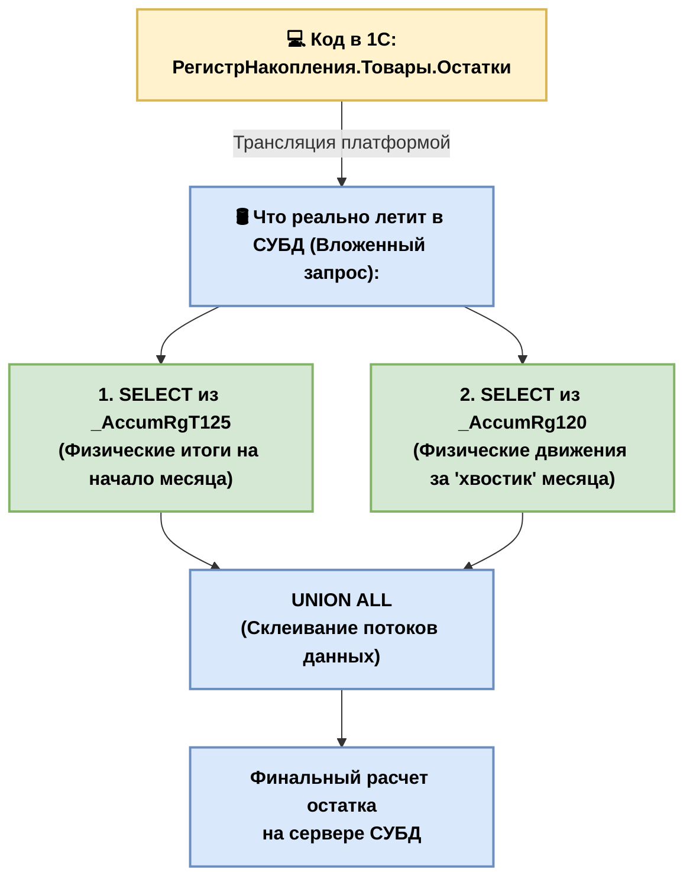
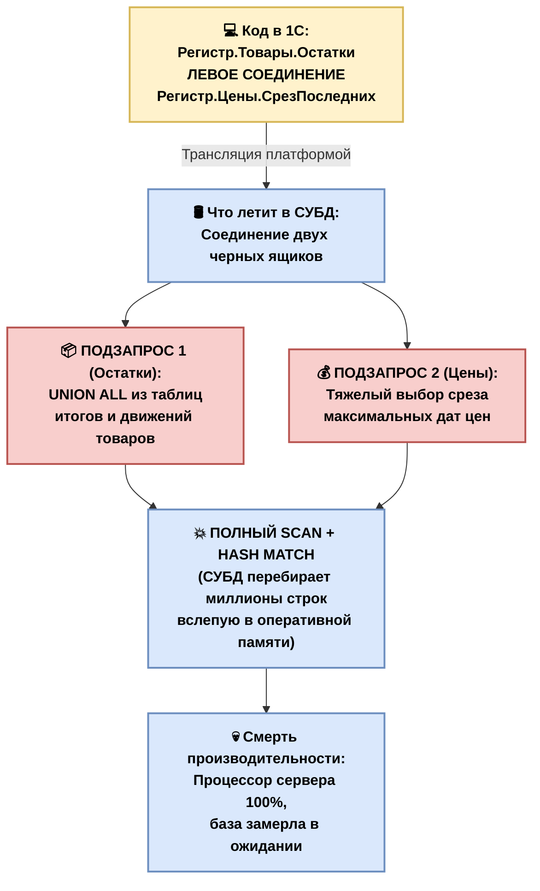

# 🚀 Оптимизация запросов Highload: Из 1С в физический SQL

Этот гайд — технический рентген, который показывает, как декларативный код 1С превращается в императивные команды СУБД, и где программисты закладывают мины замедленного действия.

---

## 🏗 Шаг 1. Физика компиляции: 1С ──> СУБД

Платформа 1С — это мощный ORM (Object-Relational Mapping). СУБД (MS SQL / Postgres) ничего не знает про объектную модель 1С. Для неё не существует «Справочников», «Документов» или «Виртуальных таблиц». 

При вызове `Запрос.Выполнить()` транслятор 1С полностью переписывает код по двум жестким правилам.

### 🧩 Правило 1. Тотальное шифрование имен
Все понятные человеку имена метаданных заменяются внутренними буквенно-цифровыми идентификаторами платформы:

* **Справочники** ──> `_ReferenceXX` (где XX — внутренний ID объекта в базе)
* **Регистры накопления** ──> `_AccumRgXX`
* **Табличные части** ──> `_DocumentXX_VT_YY`
* **Реквизиты объектов** ──> `_FldYY`

> **Исключение:** Системные поля сохраняют понятные имена: `_IDRRef` (Ссылка/GUID), `_Marked` (Пометка удаления), `_Period` (Период).

---

### 🌀 Правило 2. Развертывание абстракций (Вложенные запросы)

Программисты 1С часто пишут простую строчку:
```bsl
// Код в 1С:
Выбрать * Из РегистрНакопления.Товары.Остатки КАК Остатки
```

**Иллюзия:** Кажется, что мы делаем простой и легкий выбор из одной готовой физической таблицы.
**Реальность:** Физической таблицы `Товары.Остатки` в СУБД не существует! Это виртуальная абстракция платформы 1С. 

Чтобы СУБД поняла, что от неё хотят, транслятор 1С разворачивает эту одну строчку в **монструозный вложенный запрос (Subquery)**, который собирает данные из двух совершенно разных физических таблиц: таблицы итогов (`_AccumRgT`) и таблицы движений (`_AccumRg`).

### Физическая схема компиляции Виртуальной таблицы:



---

## 💣 Главная Highload-проблема вложенных запросов

Когда СУБД видит такой вложенный запрос под капотом, она пытается построить для него план выполнения. Но если разработчик совершает архитектурную ошибку — например, соединяет эту виртуальную таблицу через `ЛЕВОЕ СОЕДИНЕНИЕ` со сложным справочником или с другой виртуальной таблицей, происходит катастрофа.

```bsl
// ❌ ТАК ДЕЛАТЬ НЕЛЬЗЯ В HIGHLOAD:
ВЫБРАТЬ * 
ИЗ РегистрНакопления.Товары.Остатки КАК Остатки
ЛЕВОЕ СОЕДИНЕНИЕ РегистрНакопления.Цены.СрезПоследних КАК Цены ПО ...
```



### Что происходит на уровне СУБД при таком соединении:
1. Оптимизатор СУБД **не может** эффективно использовать индексы, потому что он не знает, сколько строк вернут эти подзапросы. Для него это две «черные коробки».
2. Вместо быстрого `Index Seek` Оптимизатор СУБД сходит с ума, путается в планах, паникует и включает **`Table Scan / Index Scan`** — начинает перебирать миллионы строк физических таблиц на диске, пытаясь склеить их в оперативной памяти.
3. База намертво зависает, выжигая процессоры сервера на 100%.

### 🏆 Главное правило Архитектора запросов:
Никогда не соединяй виртуальные таблицы напрямую с другими таблицами в одном запросе. Виртуальную таблицу нужно сначала "приземлить" — выгрузить её данные во Временную таблицу, и только потом делать соединения.
