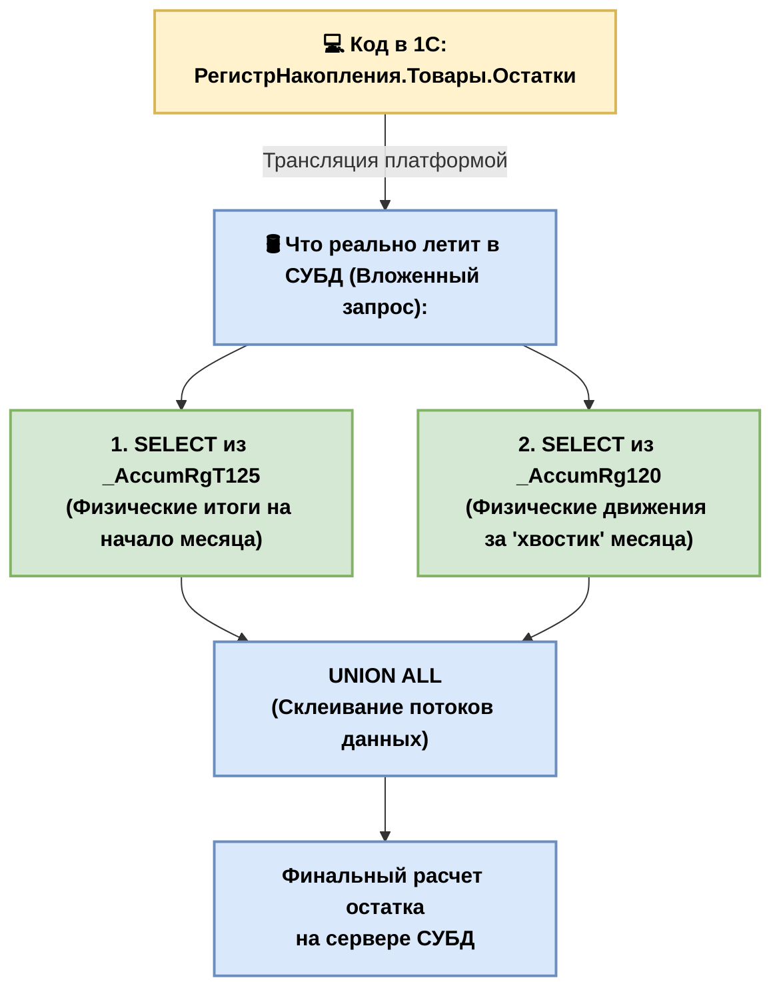
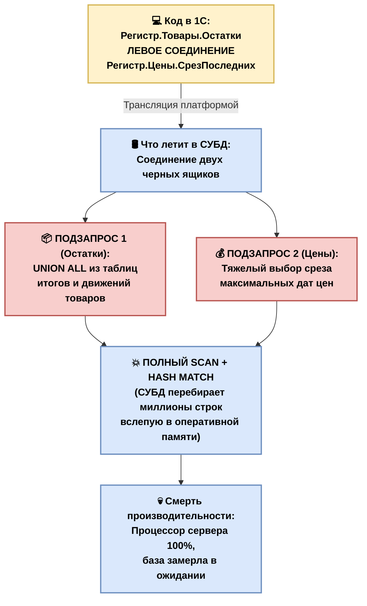
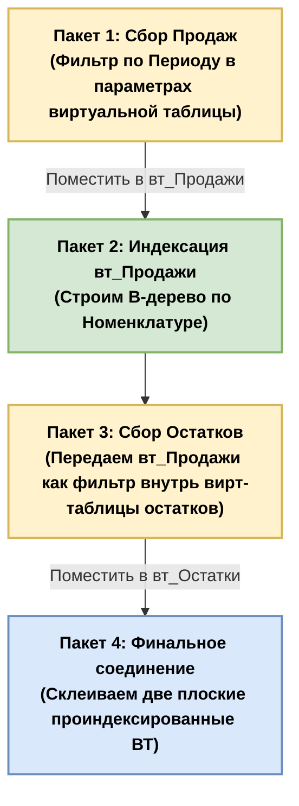
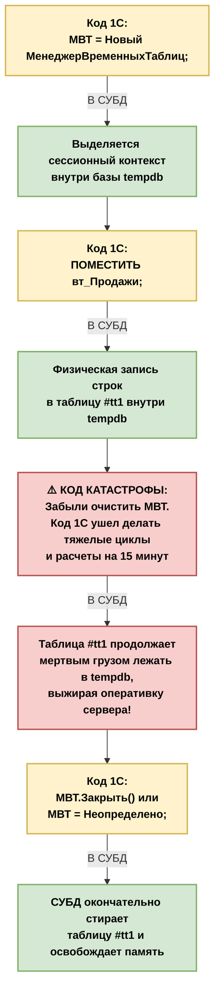
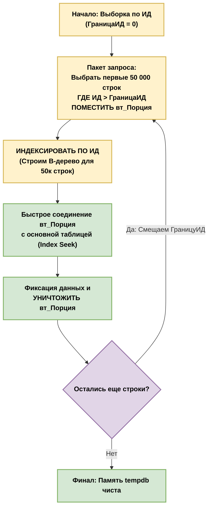
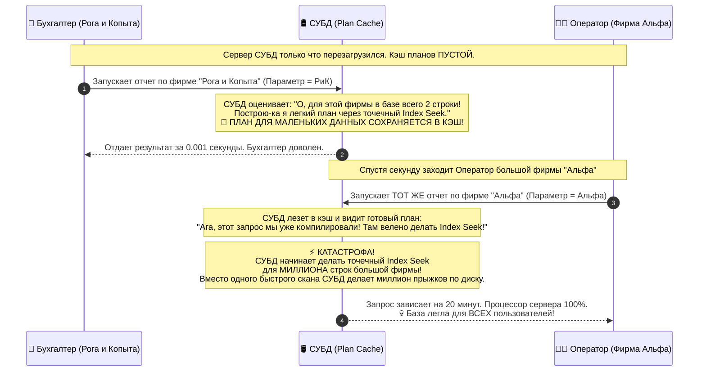

# 🚀 Оптимизация запросов Highload: Из 1С в физический SQL

Этот гайд — технический рентген, который показывает, как декларативный код 1С превращается в императивные команды СУБД, и где программисты закладывают мины замедленного действия.

---

## 🏗 Шаг 1.1. Физика компиляции: 1С ──> СУБД

Платформа 1С — это мощный ORM (Object-Relational Mapping). СУБД (MS SQL / Postgres) ничего не знает про объектную модель 1С. Для неё не существует «Справочников», «Документов» или «Виртуальных таблиц». 

При вызове `Запрос.Выполнить()` транслятор 1С полностью переписывает код по двум жестким правилам.

### 🧩 Правило 1. Тотальное шифрование имен
Все понятные человеку имена метаданных заменяются внутренними буквенно-цифровыми идентификаторами платформы:

* **Справочники** ──> `_ReferenceXX` (где XX — внутренний ID объекта в базе)
* **Регистры накопления** ──> `_AccumRgXX`
* **Табличные части** ──> `_DocumentXX_VT_YY`
* **Реквизиты объектов** ──> `_FldYY`

> **Исключение:** Системные поля сохраняют понятные имена: `_IDRRef` (Ссылка/GUID), `_Marked` (Пометка удаления), `_Period` (Период).

---

### 🌀 Правило 2. Развертывание абстракций (Вложенные запросы)

Программисты 1С часто пишут простую строчку:
```bsl
// Код в 1С:
Выбрать * Из РегистрНакопления.Товары.Остатки КАК Остатки
```

**Иллюзия:** Кажется, что мы делаем простой и легкий выбор из одной готовой физической таблицы.
**Реальность:** Физической таблицы `Товары.Остатки` в СУБД не существует! Это виртуальная абстракция платформы 1С. 

Чтобы СУБД поняла, что от неё хотят, транслятор 1С разворачивает эту одну строчку в **монструозный вложенный запрос (Subquery)**, который собирает данные из двух совершенно разных физических таблиц: таблицы итогов (`_AccumRgT`) и таблицы движений (`_AccumRg`).

### Физическая схема компиляции Виртуальной таблицы:



---

## 💣 Главная Highload-проблема вложенных запросов

Когда СУБД видит такой вложенный запрос под капотом, она пытается построить для него план выполнения. Но если разработчик совершает архитектурную ошибку — например, соединяет эту виртуальную таблицу через `ЛЕВОЕ СОЕДИНЕНИЕ` со сложным справочником или с другой виртуальной таблицей, происходит катастрофа.

```bsl
// ❌ ТАК ДЕЛАТЬ НЕЛЬЗЯ В HIGHLOAD:
ВЫБРАТЬ * 
ИЗ РегистрНакопления.Товары.Остатки КАК Остатки
ЛЕВОЕ СОЕДИНЕНИЕ РегистрНакопления.Цены.СрезПоследних КАК Цены ПО ...
```



### Что происходит на уровне СУБД при таком соединении:
1. Оптимизатор СУБД **не может** эффективно использовать индексы, потому что он не знает, сколько строк вернут эти подзапросы. Для него это две «черные коробки».
2. Вместо быстрого `Index Seek` Оптимизатор СУБД сходит с ума, путается в планах, паникует и включает **`Table Scan / Index Scan`** — начинает перебирать миллионы строк физических таблиц на диске, пытаясь склеить их в оперативной памяти.
3. База намертво зависает, выжигая процессоры сервера на 100%.

### 🏆 Главное правило Архитектора запросов:
Никогда не соединяй виртуальные таблицы напрямую с другими таблицами в одном запросе. Виртуальную таблицу нужно сначала "приземлить" — выгрузить её данные во Временную таблицу, и только потом делать соединения.

---

## 🏗 Шаг 1.2. Анатомия типов: Как 1С шифрует данные на диске СУБД

Платформа 1С является жестким транслятором типов. СУБД (MS SQL / Postgres) требует, чтобы у каждой колонки был строго один физический тип данных. 

Самый большой кошмар для СУБД начинается тогда, когда разработчик создает в 1С реквизит **Составного типа данных** (например, когда в поле `ДокументОснование` можно записать и *Приходную накладную*, и *Акт*, и *Договор*). 

Поскольку СУБД не может хранить разные сущности в одной ячейке, платформа 1С применяет **механизм расщепления полей** — она превращает одну колонку из конфигуратора в несколько физических колонок в таблице СУБД.

### 📋 Шпаргалка по трансформации типов данных:


| Тип данных в 1С | Кол-во колонок в СУБД | Имя колонки на уровне СУБД | Что там лежит физически |
| :--- | :---: | :--- | :--- |
| **Строка** | 1 | `_Fld123` | Обычный текстовый `NVARCHAR` |
| **Число** | 1 | `_Fld124` | Число с плавающей точкой `NUMERIC` |
| **Дата** | 1 | `_Fld125` | Физический тип `DATETIME` |
| **Булево** | 1 | `_Fld126` | Числовой тип `BINARY(1)` (0 или 1) |
| **Составной тип** (Ссылки) | **3 или 4** | `_Fld128_TYPE`<br>`_Fld128_TRef`<br>`_Fld128_RRef`<br>`_Fld128_S` | **Логика расщепления поля 1С:**<br>• `_TYPE` — Маркер (число, строка или ссылка)<br>• `_TRef` — Номер таблицы метаданных (какой объект)<br>• `_RRef` — Сам GUID строки на диске<br>• `_S` — Текст (если в составной тип входит строка) |
| **1. Чистый ссылочный составной**<br>*(Пример: Справочник.Склады + Документ.Договоры)* | **3** | `_Fld128_TYPE`<br>`_Fld128_TRef`<br>`_Fld128_RRef` | **Идеальный ссылочный трансформер:**<br>• `_TYPE` — Всегда содержит маркер ссылки (`0x08`)<br>• `_TRef` — Идентификатор таблицы конкретного объекта<br>• `_RRef` — Физический 16-байтный GUID записи |
| **2. Ссылки + Строка (или один примитивный тип)**<br>*(Пример: Документ.Счет + Строка)* | **4** | `_Fld128_TYPE`<br>`_Fld128_TRef`<br>`_Fld128_RRef`<br>`_Fld128_S` | **Добавляется текстовый контейнер:**<br>• Первые 3 колонки работают, только если записана ссылка<br>• `_S` — Активируется (`NVARCHAR`), если менеджер написал текст руками. При этом в `_TYPE` падает маркер строки (`0x02`) |
| **3. Два и более примитивных типа**<br>*(Пример: Число + Дата + Булево)* | **4** | `_Fld128_TYPE`<br>`_Fld128_N`<br>`_Fld128_D`<br>`_Fld128_B` | **Парад примитивов (Без ссылок):**<br>• `_TYPE` — Хранит маркер активного в данный момент типа<br>• `_N` — Выделенное поле под Число (`NUMERIC`)<br>• `_D` — Выделенное поле под Дату (`DATETIME`)<br>• `_B` — Выделенное поле под Булево (`BINARY(1)`) |
| **4. Полный хаос (Намешано вообще всё и сразу)**<br>*(Пример: Ссылка + Число + Дата + Строка)* | **6** | `_Fld128_TYPE`<br>`_Fld128_TRef`<br>`_Fld128_RRef`<br>`_Fld128_S`<br>`_Fld128_N`<br>`_Fld128_D` | **Максимальное расщепление СУБД:**<br>Платформа резервирует под одно поле в 1С **ШЕСТЬ физических колонок на диске СУБД**. В зависимости от того, что записано в строку, работает только одна пара колонок, а остальные заполняются значениями `NULL` или дефолтными нулями. |

---

### 🔍 Рентген составного поля на физическом диске СУБД

Представь, что у тебя есть документ `Реализация`. В нем есть составной реквизит `ДокументОснование`, куда менеджер может прикрепить `СчетНаОплату` или `ДоговорКонтрагента`. 

На уровне СУБД одна эта колонка превращается в **три параллельные колонки**:

```text

| _Fld500_TYPE (Тип) | _Fld500_TRef (Какая таблица) | _Fld500_RRef (Какой GUID)         |
|--------------------|------------------------------|-----------------------------------|
| 0x08 (Это Ссылка)  | 0x00000045 (Таблица Счетов)  | 0x80DB00155D010101... (GUID счета) |
| 0x08 (Это Ссылка)  | 0x00000062 (Таблица Договоров)| 0x80DB00155D010102... (GUID дог.)  |
```

### 💣 Главный Highload-вывод Архитектора запросов:

Когда ты пишешь в 1С простое условие:
```bsl
ГДЕ ДокументОснование = &ВыбранноеОснование
```
Транслятор 1С генерирует для СУБД тяжелый SQL-код, который вынужден сравнивать **сразу три колонки одновременно**: 
`WHERE _Fld500_TYPE = ... AND _Fld500_TRef = ... AND _Fld500_RRef = ...`.

Если таких составных полей в твоем запросе много, Оптимизатор СУБД путается в комбинациях колонок, перестает понимать статистику данных, пугается и вместо быстрого `Index Seek` сбрасывает запрос в полный **`Index Scan / Table Scan`**. Поля составного типа — это скрытые тормоза любого сложного запроса.


# ❌ Синтаксические убийцы производительности в запросах 1С

Каждый раз, когда ты используешь эти конструкции на больших объемах данных (Highload), Оптимизатор СУБД лишается возможности использовать B-деревья индексов. Вместо быстрого точечного поиска (`Seek`) база уходит в полный перебор строк (`Scan`).

---

## 💣 1. Соединения с подзапросами или Виртуальными таблицами

### ❌ КАТАСТРОФА (Как писать НЕЛЬЗЯ):
```bsl
ВЫБРАТЬ
    ПродажиОбороты.Номенклатура,
    ЦеныСрезПоследних.Цена
ИЗ
    РегистрНакопления.Продажи.Обороты КАК ПродажиОбороты
    ЛЕВОЕ СОЕДИНЕНИЕ РегистрСведений.ЦеныНоменклатуры.СрезПоследних КАК ЦеныСрезПоследних
        ПО ПродажиОбороты.Номенклатура = ЦеныСрезПоследних.Номенклатура
```

### 🪓 Что происходит под капотом СУБД:
Поскольку обе таблицы являются виртуальными абстракциями 1С, СУБД под капотом пытается соединить **два независимых вложенных запроса**. 

Оптимизатор СУБД не знает, сколько строк вернут эти подзапросы, у него нет по ним актуальной статистики. Для него это два «черных ящика». Он не может использовать дисковые индексы для данных, которые еще только вычисляются «в воздухе». 

Вместо быстрого `Index Seek` СУБД паникует и включает алгоритм **`Hash Match`** или полный перебор. СУБД начинает выкачивать миллионы строк в оперативную память, чтобы склеить их вручную. База виснет, выжигая процессор на 100%.

### 🟢 Как это лечит Архитектор (Через Временные Таблицы):
```bsl
// 1. Сначала "приземляем" первую таблицу во Временную Таблицу (вт_Продажи)
ВЫБРАТЬ ПродажиОбороты.Номенклатура ПОМЕСТИТЬ вт_Продажи ИЗ РегистрНакопления.Продажи.Обороты;

// 2. "Приземляем" вторую таблицу во вторую ВТ (вт_Цены)
ВЫБРАТЬ Цены.Номенклатура, Цены.Цена ПОМЕСТИТЬ вт_Цены ИЗ РегистрСведений.ЦеныНоменклатуры.СрезПоследних;

// 3. Соединяем две плоские физические таблицы, по которым у СУБД есть четкие индексы!
ВЫБРАТЬ вт_Продажи.Номенклатура, вт_Цены.Цена ИЗ вт_Продажи ЛЕВОЕ СОЕДИНЕНИЕ вт_Цены ПО ...
```

---

## 💣 2. Условие `ГДЕ Поле ПОДОБНО "%Текст%"` (Неявный Scan)

### ❌ КАТАСТРОФА (Как писать НЕЛЬЗЯ):
```bsl
ВЫБРАТЬ Ссылка ИЗ Справочник.Номенклатура ГДЕ Наименование ПОДОБНО "%Стол%"
```

### 🪓 Что происходит под капотом СУБД:
Знак процента `%` в самом начале поисковой строки — это смертный приговор для производительности. B-дерево индекса отсортировано по алфавиту слева направо. Если мы ищем слово, которое *начинается* на "Стол" (`"Стол%"`), СУБД сделает быстрый и красивый `Index Seek`. 

Но если процент стоит в начале (`"%Стол%"`), СУБД не знает, в какую ветку дерева прыгать. Ей приходится включать полный **`Index Scan / Table Scan`** и перебирать всю базу номенклатуры построчно, заглядывая внутрь каждого слова.

### 🟢 Как это лечит Архитектор:
Для поиска внутри строк на больших базах запрещено использовать оператор `ПОДОБНО` с процентом впереди. Используется встроенный механизм 1С — **Полнотекстовый поиск (ППИ)**, который работает через отдельные, специально оптимизированные инвертированные индексы.

---

## 💣 3. Использование подзапросов в условии `ГДЕ ... В (ВЫБРАТЬ ...)`

### ❌ КАТАСТРОФА (Как писать НЕЛЬЗЯ):
```bsl
ВЫБРАТЬ Ссылка ИЗ Справочник.Номенклатура
ГДЕ Ссылка В (ВЫБРАТЬ Номенклатура ИЗ РегистрНакопления.Товары.Остатки)
```

### 🪓 Что происходит под капотом СУБД:
Для СУБД конструкция `В (ВЫБРАТЬ ...)` часто превращается в **Зависимый подзапрос (Correlated Subquery)**. 

Вместо того чтобы выполнить внутренний запрос один раз, СУБД вынуждена выполнять подзапрос остатков *для каждой строки* справочника Номенклатуры! Если в справочнике 100 000 товаров, СУБД выполнит внутренний запрос 100 000 раз.

### 🟢 Как это лечит Архитектор:
Подзапрос из условия `ГДЕ` переносится во Временную таблицу, а затем соединяется через классическое внутреннее соединение (`ВНУТРЕННЕЕ СОЕДИНЕНИЕ`):
```bsl
// Сначала собираем уникальный список номенклатуры во временную таблицу
ВЫБРАТЬ РАЗЛИЧНЫЕ Номенклатура ПОМЕСТИТЬ вт_Остатки ИЗ РегистрНакопления.Товары.Остатки;

// Затем делаем быстрое Внутреннее соединение со справочником
ВЫБРАТЬ Ссылка ИЗ Справочник.Номенклатура ВНУТРЕННЕЕ СОЕДИНЕНИЕ вт_Остатки ПО ...
```

---

## 💣 4. Обращение к полям через точку на глубоких уровнях

### ❌ КАТАСТРОФА (Как писать НЕЛЬЗЯ):
```bsl
ВЫБРАТЬ Документ.Ссылка, Документ.Контрагент.ОсновнойДоговор.Валюта.Код ИЗ Документ.Реализация
```

### 🪓 Что происходит под капотом СУБД:
Каждая точка в запросе 1С, если это ссылочное поле — это приказ транслятору сделать скрытое **`ЛЕВОЕ СОЕДИНЕНИЕ (LEFT JOIN)`** с таблицей этого объекта. 

В примере выше одна эта строчка заставит 1С сгенерировать SQL-код с **четырьмя скрытыми `LEFT JOIN`**. Таблица документов соединится с контрагентами, те с договорами, договоры с валютами, валюты со своим справочником. СУБД строит гигантский план, который падает по производительности при росте базы.

### 🟢 Как это лечит Архитектор:
Если данные нужны для вывода, соединения выстраиваются явно через Временные таблицы, ограничивая выборку строк только нужными документами (например, за текущий день), а не всей таблицей СУБД за раз.


# 🏆 Шаблон идеально оптимизированного запроса 1С (Highload-стандарт)

Этот запрос решает классическую задачу: собрать данные по продажам за период, подтянуть актуальные остатки на конкретном складе и вывести информацию, не заблокировав базу и не вызвав `Index Scan` в СУБД.

---

## 🎨 Схема архитектурных слоев запроса

Каждый шаг «приземляет» данные, подготавливая для СУБД идеальные плоские физические таблицы с актуальной статистикой.



---

## 🧑‍💻 Эталонный BSL / SQL код запроса

### Для маленького соединения строк(до 100-500)

```bsl
// 1. Избавляемся от поиска по наименованию (для примера берем пустую ссылку или предопределенный)
// В реальном коде тут должна быть ссылка, переданная из настроек/форм
ВыбранныйСклад = Справочники.Склады.Основной; 

Запрос = Новый Запрос;
// Использование МВТ оправдано, только если таблицы нужны дальше в коде. 
// Если всё внутри одного пакета, менеджер создавать вручную не обязательно, платформа сделает это сама.

Запрос.Текст = 
    "ВЫБРАТЬ

    |	ПродажиОбороты.Номенклатура КАК Номенклатура,
    |	ПродажиОбороты.КоличествоОборот КАК КоличествоПродано,
    |	ПродажиОбороты.СуммаВыручкиОборот КАК Выручка

    |ПОМЕСТИТЬ вт_Продажи
    |ИЗ
    |	РегистрНакопления.ВыручкаИСебестоимостьПродаж.Обороты(&НачалоПериода, &КонецПериода, , ) КАК ПродажиОбороты

    |
    |ИНДЕКСИРОВАТЬ ПО
    |	Номенклатура

    |;
    |
    |////////////////////////////////////////////////////////////////////////////////

    |ВЫБРАТЬ
    |	вт_Продажи.Номенклатура КАК Товар,
    |	вт_Продажи.КоличествоПродано КАК ПроданоКоличество,

    |	вт_Продажи.Выручка КАК СуммаВыручки,
    |	ЕСТЬNULL(ТоварыНаСкладахОстатки.ВНаличииОстаток, 0) КАК ТекущийОстаток
    |ИЗ

    |	вт_Продажи КАК вт_Продажи
    |		// Соединяем напрямую! СУБД использует индекс из вт_Продажи 
    |		// для максимально быстрой выборки остатков только по нужным товарам

    |		ЛЕВОЕ СОЕДИНЕНИЕ РегистрНакопления.ТоварыНаСкладах.Остатки(, Склад = &ВыбранныйСклад) КАК ТоварыНаСкладахОстатки
    |		ПО вт_Продажи.Номенклатура = ТоварыНаСкладахОстатки.Номенклатура";

Запрос.УстановитьПараметр("НачалоПериода",  Накануне);
Запрос.УстановитьПараметр("КонецПериода",    ТекущаяДата());
Запрос.УстановитьПараметр("ВыбранныйСклад", ВыбранныйСклад);

РезультатЗапроса = Запрос.Выполнить();
```

### Для большого соединения строк(>100-500)


```bsl
// 1. Избавляемся от поиска по наименованию (для примера берем пустую ссылку или предопределенный)
// В реальном коде тут должна быть ссылка, переданная из настроек/форм
ВыбранныйСклад = Справочники.Склады.Основной; 

Запрос = Новый Запрос;
// Использование МВТ оправдано, только если таблицы нужны дальше в коде. 
// Если всё внутри одного пакета, менеджер создавать вручную не обязательно, платформа сделает это сама.

Запрос.Текст = 
    "ВЫБРАТЬ

    |	ПродажиОбороты.Номенклатура КАК Номенклатура,
    |	ПродажиОбороты.КоличествоОборот КАК КоличествоПродано,
    |	ПродажиОбороты.СуммаВыручкиОборот КАК Выручка

    |ПОМЕСТИТЬ вт_Продажи
    |ИЗ
    |	РегистрНакопления.ВыручкаИСебестоимостьПродаж.Обороты(&НачалоПериода, &КонецПериода, , ) КАК ПродажиОбороты

    |
    |ИНДЕКСИРОВАТЬ ПО
    |	Номенклатура

    |;
    |
    |////////////////////////////////////////////////////////////////////////////////

    |ВЫБРАТЬ
    |	ТоварыНаСкладахОстатки.Номенклатура КАК Номенклатура,
    |	ТоварыНаСкладахОстатки.ВНаличииОстаток КАК ОстатокНаСкладе

    |ПОМЕСТИТЬ вт_Остатки
    |ИЗ
    |	вт_Продажи КАК вт_Продажи

    |		// Фильтрацию по номенклатуре делаем через ВНУТРЕННЕЕ СОЕДИНЕНИЕ с индексированной ВТ
    |		ВНУТРЕННЕЕ СОЕДИНЕНИЕ РегистрНакопления.ТоварыНаСкладах.Остатки(, Склад = &ВыбранныйСклад) КАК ТоварыНаСкладахОстатки
    |		ПО вт_Продажи.Номенклатура = ТоварыНаСкладахОстатки.Номенклатура

    |;
    |
    |////////////////////////////////////////////////////////////////////////////////

    |ВЫБРАТЬ
    |	вт_Продажи.Номенклатура КАК Товар,
    |	вт_Продажи.КоличествоПродано КАК ПроданоКоличество,

    |	вт_Продажи.Выручка КАК СуммаВыручки,
    |	ЕСТЬNULL(вт_Остатки.ОстатокНаСкладе, 0) КАК ТекущийОстаток
    |ИЗ

    |	вт_Продажи КАК вт_Продажи
    |		ЛЕВОЕ СОЕДИНЕНИЕ вт_Остатки КАК вт_Остатки
    |		ПО вт_Продажи.Номенклатура = вт_Остатки.Номенклатура";

Запрос.УстановитьПараметр("НачалоПериода",  Накануне);
Запрос.УстановитьПараметр("КонецПериода",    ТекущаяДата());
Запрос.УстановитьПараметр("ВыбранныйСклад", ВыбранныйСклад);

РезультатЗапроса = Запрос.Выполнить();
```
---

## 🧠 Почему этот запрос заставит СУБД летать? (Разбор фишек)

### 💎 Фишка №1. Идеальные параметры Виртуальных Таблиц
Обрати внимание на первую ВТ (`вт_Продажи`). Мы передали параметры `&НачалоПериода` и `&КонецПериода` **внутрь круглых скобок** виртуальной таблицы. 
* **Что делает СУБД:** Она делает выборку из физических таблиц итогов сразу по узкому диапазону дат.
* **Если бы мы написали через `ГДЕ`:** СУБД сначала подняла бы в память продажи за ВСЕ года существования фирмы, и только потом начала бы отсекать лишнее.

### 💎 Фишка №2. Сверхбыстрая индексация ВТ на лету
Ключевое слово `ИНДЕКСИРОВАТЬ ПО Номенклатура` в конце первого пакета — это прямой приказ для СУБД: *«Создай в базе tempdb для таблицы вт_Продажи отдельное, независимое некластерное B-дерево индекса по полю Номенклатура!»*. Теперь любые поиски по этой ВТ будут идти через `Index Seek`.

### 💎 Фишка №3. Фильтр "Перекрёстный огонь" во втором пакете
Посмотри, как собираются остатки во второй ВТ (`вт_Остатки`). Мы не берем остатки вообще всех товаров в базе. Внутрь параметров виртуальной таблицы мы засунули подзапрос: `Номенклатура В (ВЫБРАТЬ вт_Продажи.Номенклатура ИЗ вт_Продажи)`.
* **Что делает СУБД:** Благодаря тому, что `вт_Продажи` уже проиндексирована, СУБД мгновенно вытаскивает остатки **только по тем товарам, которые реально продавались за этот месяц**. Срез остатков по всей базе сужается до крошечной выборки.

### 💎 Фишка №4. Никаких «черных ящиков» в финальном соединении
В самом конце мы соединяем `вт_Продажи` и `вт_Остатки`. Это соединение двух **реальных, плоских, проиндексированных физических таблиц**, которые уже лежат на диске (в `tempdb`). У Оптимизатора СУБД есть по ним 100% точная статистика строк. Он радостно выбирает план `Merge Join` или точечный `Index Seek` и выдает результат за миллисекунды.


# 🛢 Шаг 3. Временные таблицы и Магия базы `tempdb`

Когда ты пишешь в запросе 1С ключевое слово `ПОМЕСТИТЬ вт_Данные`, внутри СУБД происходит физическое действие: создание реальной локальной таблицы в служебной базе данных **`tempdb`** (в MS SQL) или во временных схемах оперативной памяти (в PostgreSQL).

Но у этого механизма есть жесткая изнанка. Временная таблица — это **НЕ бесплатная магия**. Это сделка: мы ускоряем Оптимизатор СУБД, расплачиваясь за это дисковой подсистемой и оперативной памятью сервера.

---

## 🛑 Уровень 1. Закон компромисса: Когда ВТ — спасение, а когда — вред?

В дикой природе Highload выбор архитектора всегда зависит от **объема данных** (селективности выборки) и частоты запуска запроса.

### 📊 Матрица архитектурных решений:


| Объём данных (Строк) | Что быстрее: Соединение «в воздухе» | Что быстрее: Выгрузка во Временную Таблицу | Почему так происходит (Физика СУБД) |
| :--- | :---: | :---: | :--- |
| **Крошечный**<br>*(до 50-100 строк)* | 🚀 **Быстрее** | 🐌 Тормозит | Накладные расходы СУБД на создание таблицы в `tempdb`, выделение страниц памяти, построение B-дерева индекса и последующее удаление **в разы превышают** мизерный выигрыш от её использования. |
| **Средний**<br>*(от 500 до 10 000 строк)* | 🐌 Тормозит | 🚀 **Быстрее** | Оптимизатору СУБД критически нужна точная статистика строк, чтобы выбрать правильный план соединения (`Merge Join` или `Nested Loops`). ВТ дает ему эту статистику. |
| **Гигантский**<br>*(более 1 000 000 строк)* | 💀 **Смерть базы** | ⚠️ **Опасно** | При таком объеме ВТ перестает помещаться в оперативную память сервера. СУБД включает механизм *Paging* — начинает сбрасывать данные из ОЗУ на жесткий диск, полностью парализуя дисковую систему. |

---

## 🟢 Уровень 2. Жизненный цикл МВТ (Где и сколько живут данные?)

Временная таблица в `tempdb` живет ровно столько, сколько живет объект **`МенеджерВременныхТаблиц`** в твоем bsl-коде. Пакетный разделитель (точка с запятой `;` в запросе) таблицу **НЕ стирает**.

### Карта жизни ВТ на диске СУБД:



---

## ⚡ Уровень 3. Две специфические Highload-катастрофы базы `tempdb`

Когда сотни параллельных пользователей начинают бездумно пихать ВТ во все запросы, сервер СУБД ловит две системные болезни:

### 💥 Болезнь 1. Контенция служебных страниц (Борьба за карандаш)
В MS SQL база `tempdb` — одна общая коммуналка для всех рабочих процессов. Когда 100 сессий одновременно кричат: «Дай мне место под ВТ!», СУБД начинает распределять блоки памяти через служебные страницы (`GAM`, `SGAM`, `PFS`). 
* **Аналогия:** Представь класс, где 100 учеников одновременно хотят писать, но на весь класс есть только **один** дежурный с карандашом, который выдает листы бумаги. Выстраивается дикая системная очередь за самим распределением памяти (`PFS/SGAM page latch contention`). База данных замирает, хотя процессор и диск могут быть свободны.

### 💥 Болезнь 2. Раздувание кэша СУБД (Хлам в памяти)
Каждое создание индекса на ВТ (`ИНДЕКСИРОВАТЬ ПО ...`) заставляет СУБД генерировать B-дерево. Если запрос вызывается 1000 раз в минуту для маленьких порций данных, СУБД забивает свою оперативную память (Buffer Pool) метаданными и схемами этих временных индексов, выбрасывая из кэша реально полезные данные живых таблиц 1С.

---

## 💡 Ультимативный чек-лист Архитектора по работе с ВТ:

1. **Правило микро-объемов:** Если ты точно знаешь, что в таблице будет **меньше 50 строк** (например, список из 3-х выбранных складов), **НЕ ПОМЕЩАЙ** их в ВТ. Передавай их массивом в параметры запроса или соединяй «в воздухе». Накладные расходы на `tempdb` задушат скорость.
2. **Уничтожай за собой явно:** Если временная таблица выполнила свою роль в начале пакета и больше не нужна в финальных соединениях, принудительно сотри её прямо внутри текста запроса командой `УНИЧТОЖИТЬ вт_Продажи;`. Не жди, пока закроется МВТ.
3. **Индексируй по факту:** Включай директиву `ИНДЕКСИРОВАТЬ ПО ...` только тогда, когда в таблице **больше 100 строк** и по этому полю дальше пойдет соединение. Индексировать таблицу из 5 строк — это архитектурное преступление.
4. **Тюнинг СУБД:** Файлы базы данных `tempdb` на сервере всегда должны лежать на самых быстрых SSD/NVMe дисках, отдельно от основных баз данных 1С, а количество файлов данных `tempdb` должно быть строго равно количеству ядер процессора (это аппаратно лечит Болезню №1 с распределением страниц).

# ⚡ Шаг 4. Битва Титанов: Соединение таблиц от 1 000 000 строк и более

Когда размер таблиц переваливает за 1 миллион строк, стандартная логика запросов 1С упирается в физические лимиты оборудования. Оперативная память сервера СУБД (Buffer Pool) может переполниться, база начнёт бесконечно сбрасывать временные данные на диски, и система встанет в глухую пробку.

Архитектор Highload решает эту задачу на нескольких уровнях: от программного кода до изменения архитектуры всей серверной стойки.

---

## 🏗 Вариант 1. Программный уровень: Порционирование и Индексация (Batching)

Если задачу нужно решить здесь и сейчас, внутри текущей базы данных, **категорически запрещено** пытаться прочитать или поместить 1 000 000 строк в одну Временную Таблицу за один проход. СУБД не выдержит оверхеда на выделение памяти.

### 🟢 Как это делает Архитектор в коде 1С:
Данные обрабатываются «порциями» (батчами) по 10 000 – 50 000 строк в цикле, с обязательной принудительной индексацией и очисткой памяти СУБД на каждом шаге.



* **Плюсы:** Работает на стандартной конфигурации, бережёт оперативную память и не даёт раздуваться `tempdb`.
* **Минусы:** Нагрузка на дисковую подсистему возрастает из-за циклов, транзакция должна быть короткой.

---

## 🗄 Вариант 2. Уровень СУБД: Использование подсказок (Hash Join Hint)

Если СУБД выполняет соединение двух больших таблиц, Оптимизатор по умолчанию может выбрать алгоритм `Nested Loops` (Вложенные циклы). Для миллиона строк это смерть: СУБД выполнит 1 000 000 умножить на 1 000 000 операций.

### 🟢 Как это делает Архитектор:
Если таблицы гарантированно огромные, СУБД выгоднее использовать алгоритм **`Hash Match`** (когда СУБД строит хэш-таблицу по одной выборке в памяти и быстро сверяет её со второй). Чтобы принудительно заставить СУБД переключиться на этот режим, в 1С используются специальные скрытые инструкции — **хинты**.

```bsl
// Принудительное указание алгоритма соединения для СУБД MS SQL
Запрос.Текст = 
    "ВЫБРАТЬ ...

    |ИЗ Таблица1 КАК Таблица1
    |ВНУТРЕННЕЕ HASH СОЕДИНЕНИЕ Таблица2 КАК Таблица2 ПО ...";
```
*Вместо слова `ЛЕВОЕ СОЕДИНЕНИЕ` пишется `ЛЕВОЕ HASH СОЕДИНЕНИЕ` (или `ВНУТРЕННЕЕ HASH СОЕДИНЕНИЕ`).*

* **Плюсы:** СУБД мгновенно понимает правила игры и обрабатывает миллион строк в памяти через хэш-таблицы в разы быстрее.
* **Минусы:** Требует колоссального объема оперативной памяти (ОЗУ) на сервере. Если памяти не хватит, база упадёт в жестокий тормоз.

---

## ⚡ Вариант 3. Инфраструктурный Highload: Репликация СУБД (Read-Only контур)

Если этот запрос на миллион строк — это тяжелый аналитический отчет, который менеджеры или бухгалтеры хотят крутить посреди рабочего дня, запускать его в основной (продуктивной) базе **категорически запрещено**. Тяжелый `SELECT` наложит блокировки (даже разделяемые или заблокирует tempdb) и остановит работу операторов на кассах.

### 🟢 Как это делает Архитектор:
Настраивается **Репликация СУБД** (например, *AlwaysOn* в MS SQL или *Streaming Replication* в PostgreSQL).

```text
 [ Продуктивный сервер 1С ] ──(Запись накладных)──> [ 🛢️ Главная СУБД (Master) ]
                                                           │
                                            (Асинхронная копия за 0.5 сек)
                                                           ▼
 [ Аналитический сервер 1С ] <──(Тяжелый отчет)──── [ 🛢️ Реплика СУБД (Replica) ]
```

1. Операторы работают в Главной СУБД (Master). Она занимается только быстрой записью документов.
2. СУБД в фоновом режиме непрерывно копирует все изменения на второй сервер — Реплику (Replica).
3. Тяжелый запрос на миллион строк запускается на отдельном сервере 1С, который подключен **строго к Реплике**.

* **Плюсы:** Полная безопасность для пользователей. Даже если отчет на 1 000 000 строк полностью загрузит процессор реплики на 100%, менеджеры на кассах этого даже не заметят — их продуктивный контур изолирован.
* **Минусы:** Дорогостоящее решение (нужен второй сервер и лицензии). Данные в отчете могут отставать от реальности на доли секунды.

---

## 🔀 Вариант 4. Архитектурное разделение: Вынос в BI / ClickHouse

Если миллион строк — это не предел, и вам нужно регулярно скрещивать такие массивы данных для аналитики, сама реляционная СУБД (MS SQL / Postgres) становится неэффективной, так как она хранит данные построчно.

### 🟢 Как это делает Архитектор:
Строится отдельная аналитическая база данных на базе колоночной СУБД (например, **ClickHouse**).

* **Как работает:** Данные из 1С раз в час или раз в день выгружаются в ClickHouse. Поскольку ClickHouse хранит данные в колонках, он выполняет соединение и агрегацию 10 000 000 строк за 0.05 секунды на обычном железе. В 1С пользователи видят готовые красивые графики через HTTP-запросы к ClickHouse.

---

## 💡 Резюме Архитектора: Что выбрать?
1. Если строк **около 1 млн** и отчет редкий ──> используем **Вариант 1 (Батчинг по 50к строк)**.
2. Если отчет регулярный и база нагружена ──> используем **Вариант 3 (Реплика СУБД AlwaysOn)**.
3. Если это огромная аналитика (BigData) ──> строим **Вариант 4 (Выгрузка в ClickHouse/BI)**.


# 🎭 Шаг 5. Параметрический сбой (Parameter Sniffing) в СУБД

Ты можешь написать идеально оптимизированный запрос по всем правилам 1С-экспертов. Но база всё равно может внезапно лечь намертво прямо посреди рабочего дня. 

Виной этому — механизм **`Parameter Sniffing`** (Кэширование планов запросов под конкретные параметры).

---

## 🛑 Уровень 1. Как работает Кэш планов в СУБД?

Каждый раз строить план выполнения запроса (выбирать между `Seek` и `Scan`) — это тяжелая задача для процессора СУБД. Поэтому СУБД идет на хитрость: **она строит план только ОДИН раз (при самом первом запуске запроса) и сохраняет его в кэш (Plan Cache)**, чтобы использовать для всех последующих пользователей.

Когда строится первый план, СУБД «обнюхивает» (sniffing) параметры, с которыми пришел первый пользователь, смотрит на их объем и подбирает под них стратегию.

---

## 🟢 Уровень 2. Суть катастрофы: Эффект «Гнилого Кэша»

Представь регистр `ТоварыНаСкладах`. В твоей УТ 11 есть две организации:
1. **Грандиозная фирма «Альфа»** (99.9% всех записей в базе, миллионы строк).
2. **Крошечная фирма «Рога и Копыта»** (0.1% записей, всего 2 строчки данных).

А теперь посмотри, как один случайный клик мелкого бухгалтера взрывает работу всего холдинга:



* **Итог:** СУБД применила план, идеальный для 2-х строк, к выборке из 2 000 000 строк. Это и есть **Параметрический сбой (Parameter Sniffing)**. Запрос начинает тормозить именно тогда, когда данные в базе распределены неравномерно (смещены).

---

## ⚡ Уровень 3. Как этот сбой лечит Архитектор?

Если ты обнаружил по логам ТЖ, что один и тот же запрос то летает за миллисекунды, то внезапно зависает намертво, у тебя есть три пути решения:

### 🛠 Путь 1. Использование Временных Таблиц (Приземление статистики)
Ты уже знаешь этот трюк из Шага 3! Временные таблицы — это **лучшее лекарство от Parameter Sniffing в 1С**.
* Когда ты помещаешь данные во Временную Таблицу, СУБД при каждом запуске пакета заново пересчитывает статистику конкретно для этой ВТ. Кэш плана сбрасывается, и для каждого пользователя СУБД строит свой, честный и актуальный маршрут.

### 🛠 Путь 2. Очистка кэша планов вручную (Экстренная реанимация)
Если база уже лежит на лопатках в продуктивном контуре, а код переписывать некогда, администратор заходит в SSMS и принудительно вышибает плохой план из памяти СУБД:
```sql
-- Находим и удаляем конкретный сбойный план из кэша SQL Server
-- (База сразу оживет, так как СУБД перекомпилирует запрос заново)
DBCC FREEPROCCACHE (выбранный_хэндл_плана);
```

### 🛠 Путь 3. Использование хинта RECOMPILE на уровне СУБД (Ядерный вариант)
Если запрос вызывается редко, но объемы данных всегда непредсказуемы, можно принудительно заставить СУБД **никогда не кэшировать план для этого запроса**, а строить его заново при каждом выполнении:
```bsl
// Инструкция СУБД: перестраивай план каждый раз, не смотри в кэш!
Запрос.Текст = "ВЫБРАТЬ ... OPTION (RECOMPILE)";
```
> **Внимание:** Использовать `OPTION (RECOMPILE)` для запросов, которые запускаются 1000 раз в минуту (например, при проведении чеков), **запрещено**. Процессор сервера просто сгорит от постоянной перекомпиляции планов.

