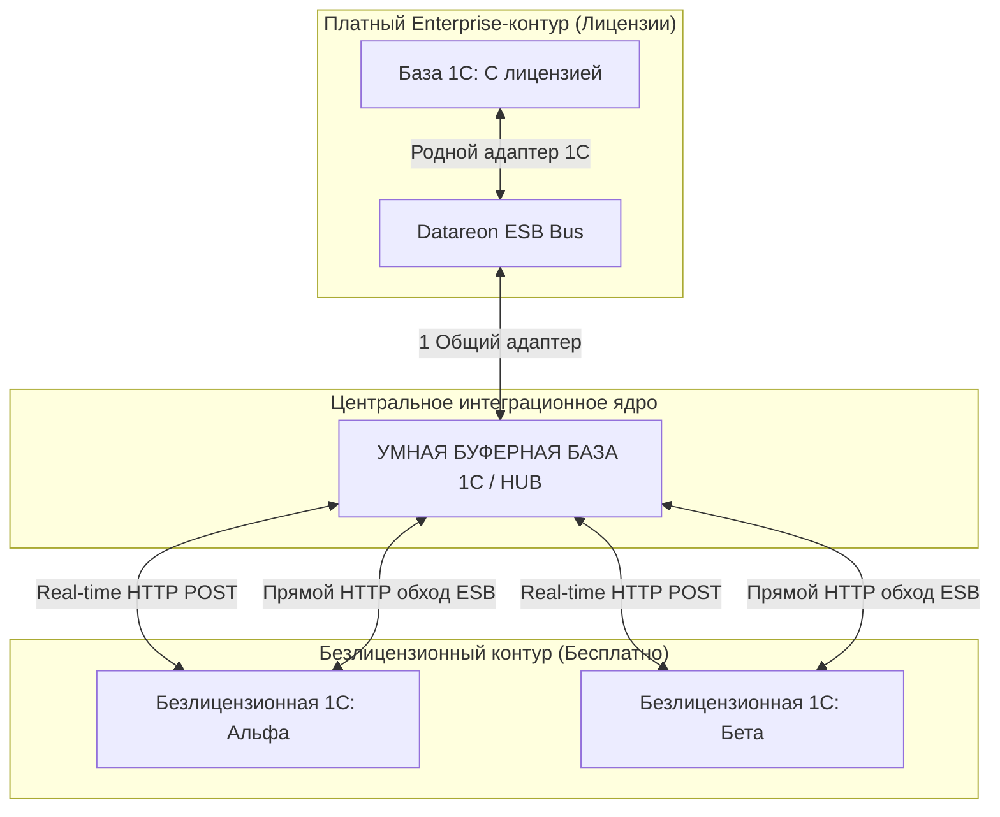
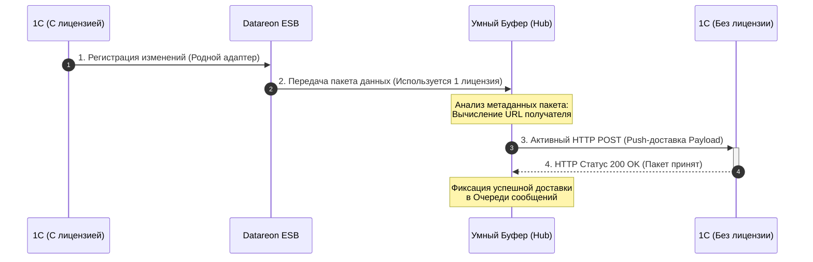
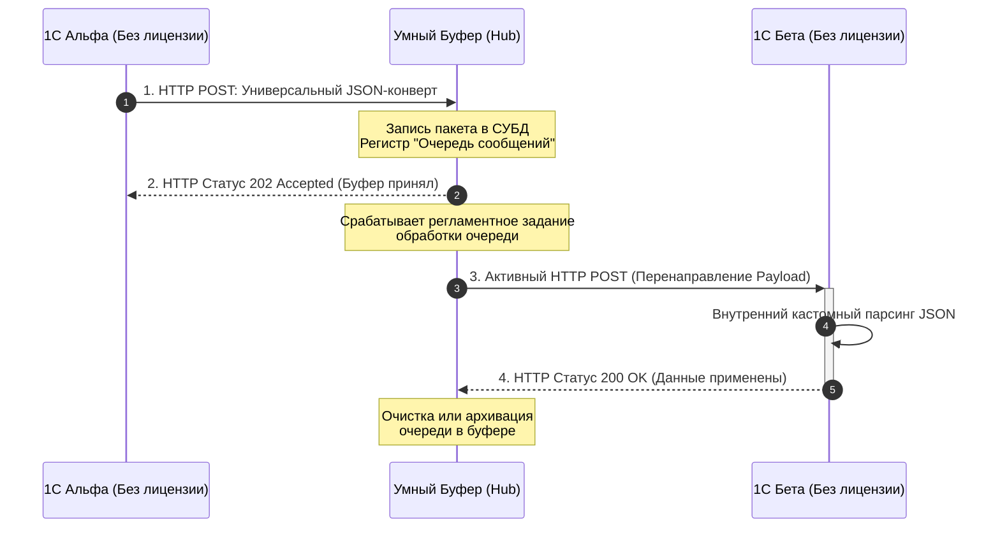
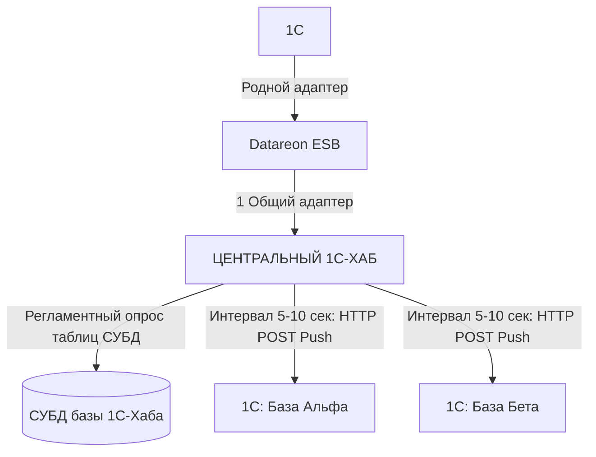
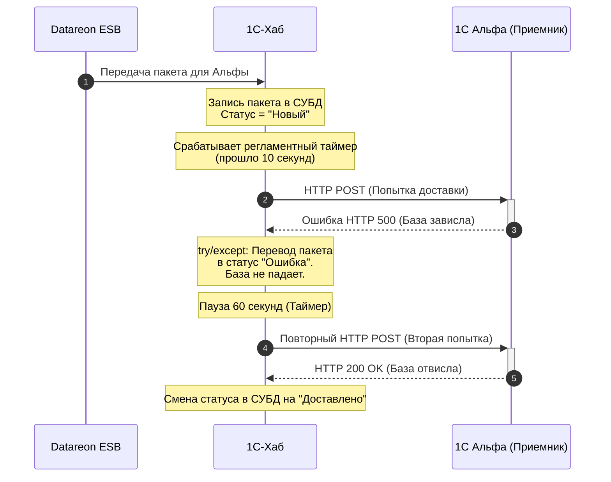
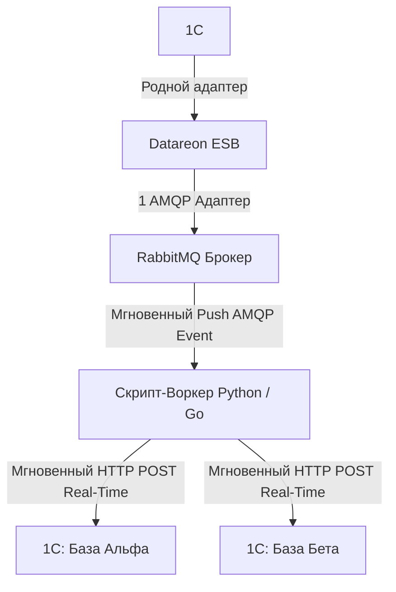
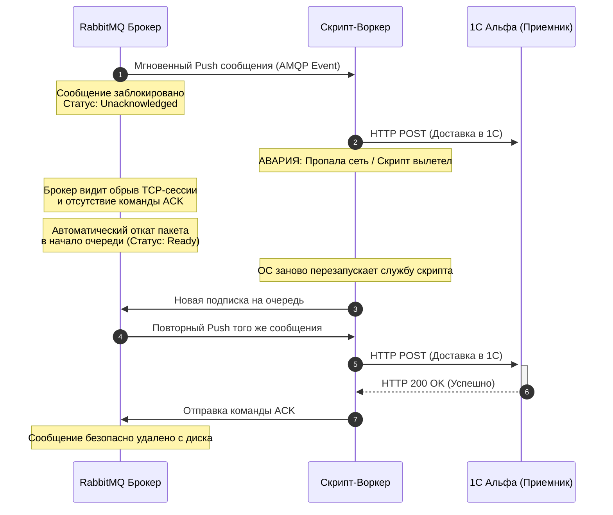

# Техническая архитектура интеграционной сети (Паттерн: Умный Буфер)

## 1. Концептуальная схема (Компоненты и топология)



---

## 2. Диаграмма последовательности (Sequence Diagram)

### Сценарий А: Передача из Лицензионной базы в Безлицензионную (Сквозь шину)



### Сценарий Б: Обмен между Безлицензионными базами напрямую (В обход Datareon)



---

## 3. Физическая структура универсального JSON-конверта

Общение всех безлицензионных баз с Умным Буфером стандартизируется под единую текстовую структуру:

```json
{
  "Header": {
    "MessageID": "f81d4fae-7dec-11d0-a765-00a0c91e6bf6",
    "Sender": "Base_Alpha",
    "Receiver": "Base_Beta",
    "MessageType": "Document_РеализацияТоваровУслуг",
    "Timestamp": "2026-08-26T12:00:00Z"
  },
  "Payload": {
    "Идентификатор1С": "УникальныйИДДокументаВБазеИсточнике",
    "Номер": "ТЛ00-001234",
    "Дата": "2026-08-26",
    "ОрганизацияИНН": "7712345678",
    "СуммаДокумента": 152000.50
  }
}
```

# Сравнительный анализ архитектурных паттернов «Умного хаба»

Документ описывает две реализации центрального буфера для обхода лицензионных ограничений Datareon ESB без покупки дополнительных адаптеров.

---

## Вариант 1. Буферная база на платформе 1С (Паттерн: Hub 1С)

Вся логика очередей и HTTP-запросов пишется на встроенном языке 1С внутри выделенной базы-хаба. Для Datareon используется **1 официальная лицензия**.

### 1.1. Топология и компоненты (1С-Хаб)



### 1.2. Таймлайн работы 1С-Хаба при ошибках



---

## Вариант 2. Высокопроизводительный брокер (Паттерн: RabbitMQ + Скрипт-Воркер)

Datareon отправляет данные через **1 AMQP-адаптер** в RabbitMQ. Рядом крутится легковесный скрипт (демон), который держит постоянную сессию с брокером по модели **Push** и мгновенно пересылает пакеты в 1С.

### 2.1. Топология и компоненты (RabbitMQ + Скрипт)



### 2.2. Таймлайн работы Скрипта при авариях (Механизм ACK/NACK)



---

## 3. Сводное сравнение характеристик хабов

| Критерий оценки | Вариант 1: Хаб на базе 1С | Вариант 2: RabbitMQ + Скрипт |
| :--- | :--- | :--- |
| **Скорость доставки** | Низкая (Зависит от тиков таймера, 5–15 сек) | **Сверхвысокая (Real-time, 1–5 миллисекунд)** |
| **Нагрузка на железо** | Высокая (Тяжелые транзакции в СУБД 1С) | Минимальная (RabbitMQ держит всё в RAM) |
| **Порог входа команды** | **Минимальный (Нужен только 1С-программист)** | Средний (Нужны базовые навыки Python/DevOps) |
| **Поведение при аварии** | Требует ручной прописи кода очередей в 1С | **Автоматическое на уровне протокола AMQP** |

