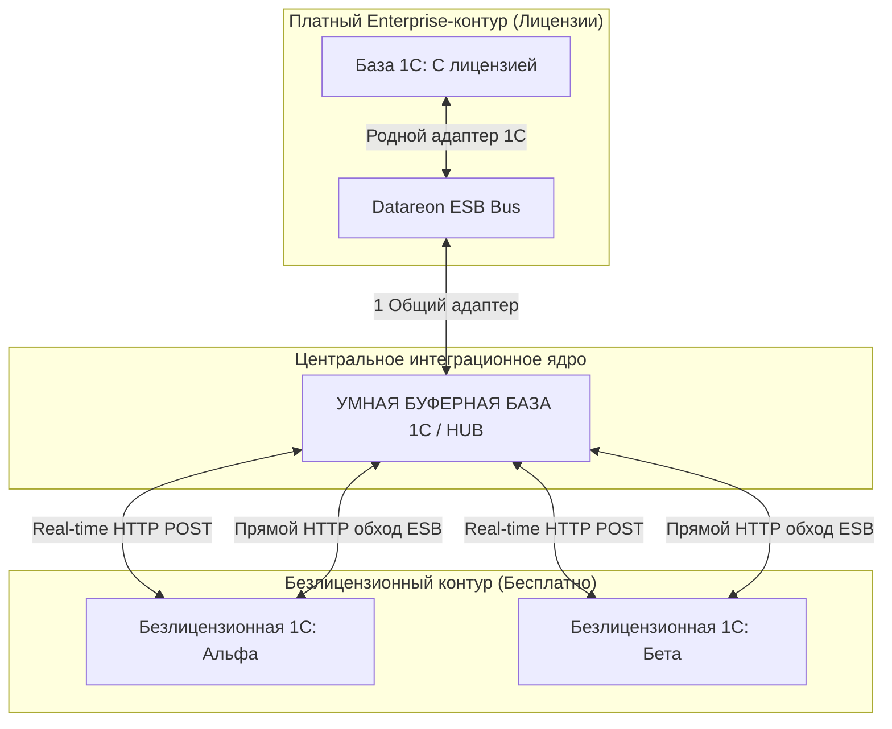
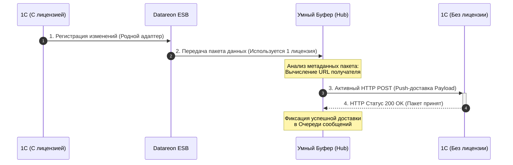
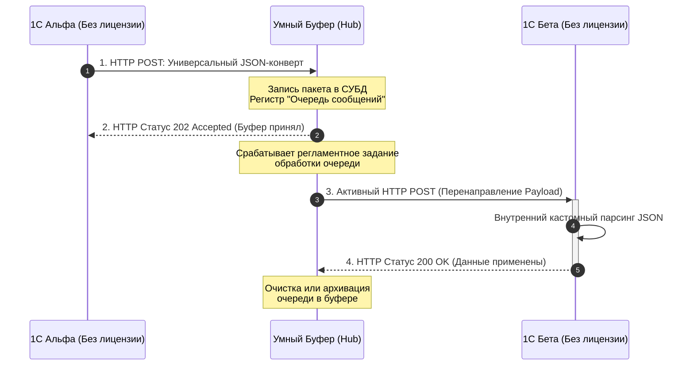

# Техническая архитектура интеграционной сети (Паттерн: Умный Буфер)

## 1. Концептуальная схема (Компоненты и топология)



---

## 2. Диаграмма последовательности (Sequence Diagram)

### Сценарий А: Передача из Лицензионной базы в Безлицензионную (Сквозь шину)



### Сценарий Б: Обмен между Безлицензионными базами напрямую (В обход Datareon)



---

## 3. Физическая структура универсального JSON-конверта

Общение всех безлицензионных баз с Умным Буфером стандартизируется под единую текстовую структуру:

```json
{
  "Header": {
    "MessageID": "f81d4fae-7dec-11d0-a765-00a0c91e6bf6",
    "Sender": "Base_Alpha",
    "Receiver": "Base_Beta",
    "MessageType": "Document_РеализацияТоваровУслуг",
    "Timestamp": "2026-08-26T12:00:00Z"
  },
  "Payload": {
    "Идентификатор1С": "УникальныйИДДокументаВБазеИсточнике",
    "Номер": "ТЛ00-001234",
    "Дата": "2026-08-26",
    "ОрганизацияИНН": "7712345678",
    "СуммаДокумента": 152000.50
  }
}
```
